<h2 style="text-align:center;">Universidad Peruana de Ciencias Aplicadas</h2>
<h2 style="text-align:center;">Ingeniería de Software</h2>
<h2 style="text-align:center;">Ciclo 2025 - 1 </h2>
<p align="center">
  
</p>
<h2 style="text-align:center;">1ASI0729 - Desarrollo de Aplicaciones Open Source</h2>
<h2 style="text-align:center;">Sección - 4341</h2>
<h2 style="text-align:center;">Docente: Juan Antonio Flores Moroco</h2>
<h2 style="text-align:center;">"Informe de Trabajo Final"</h2>
<h2 style="text-align:center;">Startup: CloseSource</h2>
<h2 style="text-align:center;">Producto: MatchEvent</h2>
<h2 style="text-align:center;">Integrantes:</h2>
<h3 style="text-align:center;">Aaron Alexander Avila Palacios</h3>
<h3 style="text-align:center;">Gabriel Anthony Braithuaite Toledo - u20201e889</h3>
<h3 style="text-align:center;">Kevin Alexander Castañeda Llanos</h3>
<h3 style="text-align:center;">Ivan Jeanpierre La Madrid Lozano</h3>
<h3 style="text-align:center;">Max Anthony Paitan Pumacahua</h3>
<h2 style="text-align:center;">2025</h2>

## Registro de Versiones del Informe
| Versión | Fecha    | Autor                      | Descripción de modificación |
|---------|----------|----------------------------|-----------------------------|
| 1.0     | 2025-04-16 | Gabriel Braithuaite Toledo| Desarollo del punto 3.1 al 3.4                    |
| 1.0     | 2025-04-20 | Aaron Avila Palacios       | Desarrollo del punto 2.3.2 al 2.4|
| 1.0     | 2025-04- | Kevin Castañeda Llanos     | Desarrollo del punto 1.2.2.2 al 1.3, 4.2.2 al 4.2.5 y del 4.8|
| 1.0     | 2025-04- | Ivan La Madrid Lozano      | Desarrollo del 2.1 al 2.3.1.                    |
| 1.0     | 2025-04- | Max Paitan Pamacahua       | Desarrollo del punto 1.1.al 1.2.2.1., 4.1. al4.2.1., y del 5.1. al 5.2.1.8 |
## Project Report Collaboration Insights
URL del repositorio de la Organizacion: https://github.com/UPC-PRE-SI729-2510-4341-G2-CloseSource
## Contenido
### Tabla de Contenido
- [Capítulo 1: Introducción](#capítulo-1-introducción)
  - [**1.1. Startup Profile**](#11-startup-profile)
    - [**1.1.1. Descripción de la Startup**](#111-descripción-de-la-startup)
      - [**Descripción de la empresa:**](#descripción-de-la-empresa)
        - [**Misión:**](#misión)
        - [**Visión:**](#visión)
    - [**1.1.2. Perfiles de integrantes del equipo**](#112-perfiles-de-integrantes-del-equipo)
      - [Nombre: Avila Palacios, Aaron Alexander | U201823654](#nombre-avila-palacios-aaron-alexander--u201823654)
      - [Nombre: Braithuaite Toledo, Gabriel Anthony | U20201e889](#nombre-braithuaite-toledo-gabriel-anthony--u20201e889)
      - [Nombre: Castañeda Llanos, Kevin Alexander | U202318814](#nombre-castañeda-llanos-kevin-alexander--u202318814)
      - [Nombre: La Madrid Lozano, Ivan Jeanpierre | UU202113432](#nombre-la-madrid-lozano-ivan-jeanpierre--uu202113432)
      - [Nombre: Paitan Pumacahua, Max Anthony | U201314454](#nombre-paitan-pumacahua-max-anthony--u201314454)
  - [**1.2. Solution Profile**](#12-solution-profile)
    - [**1.2.1 Antecedentes y problemática**](#121-antecedentes-y-problemática)
    - [**1.2.2 Lean UX Process.**](#122-lean-ux-process)
      - [**1.2.2.1. Lean UX Problem Statements.**](#1221-lean-ux-problem-statements)
    - [1.2.2.2. Lean UX Assumptions.](#1222-lean-ux-assumptions)
    - [1.2.2.3. Lean UX Hypothesis Statements.](#1223-lean-ux-hypothesis-statements)
    - [1.2.2.4. Lean UX Canvas.](#1224-lean-ux-canvas)
    - [1.3. Segmentos objetivo.](#13-segmentos-objetivo)
  - [Capítulo II: Requirements Elicitation \& Analysis](#capítulo-ii-requirements-elicitation--analysis)
    - [2.1. Competidores.](#21-competidores)
    - [2.1.1. Análisis competitivo.](#211-análisis-competitivo)
    - [2.1.2. Estrategias y tácticas frente a competidores.](#212-estrategias-y-tácticas-frente-a-competidores)
    - [2.2. .](#22-)
    - [2.2.1. Diseño de entrevistas.](#221-diseño-de-entrevistas)
      - [Objetivos de la entrevista](#objetivos-de-la-entrevista)
      - [Perfil de entrevistados](#perfil-de-entrevistados)
      - [Guía de preguntas para empresas/marcas](#guía-de-preguntas-para-empresasmarcas)
      - [Guía de preguntas para productoras](#guía-de-preguntas-para-productoras)
      - [Formato y duración](#formato-y-duración)
    - [2.2.2. Registro de entrevistas.](#222-registro-de-entrevistas)
    - [2.2.3. Análisis de entrevistas.](#223-análisis-de-entrevistas)
    - [2.3. Needfinding.](#23-needfinding)
    - [2.3.1. User Personas.](#231-user-personas)
    - [2.3.2. User Task Matrix.](#232-user-task-matrix)
      - [Tareas con mayor frecuencia e importancia:](#tareas-con-mayor-frecuencia-e-importancia)
      - [Principales diferencias:](#principales-diferencias)
      - [Coincidencias relevantes:](#coincidencias-relevantes)
    - [2.3.3. User Journey Mapping.](#233-user-journey-mapping)
    - [2.3.4. Empathy Mapping.](#234-empathy-mapping)
    - [2.3.5. As-is Scenario Mapping.](#235-as-is-scenario-mapping)
    - [2.4. Ubiquitous Language.](#24-ubiquitous-language)
    - [Ubiquitous Language – Business Domain Glossary](#ubiquitous-language--business-domain-glossary)
  - [Capítulo III: Requirements Specification](#capítulo-iii-requirements-specification)
    - [3.1. To-Be Scenario Mapping.](#31-to-be-scenario-mapping)
    - [3.2. User Stories.](#32-user-stories)
    - [3.3. Impact Mapping.](#33-impact-mapping)
    - [3.4. Product Backlog.](#34-product-backlog)
- [**Capítulo IV: Product Design**](#capítulo-iv-product-design)
  - [**4.1. Style Guidelines.**](#41-style-guidelines)
    - [**4.1.1. General Style Guidelines.**](#411-general-style-guidelines)
    - [**4.1.2. Web Style Guidelines.**](#412-web-style-guidelines)
  - [**4.2. Information Architecture.**](#42-information-architecture)
    - [**4.2.1. Organization Systems.**](#421-organization-systems)
    - [4.2.2. Labeling Systems.](#422-labeling-systems)
    - [4.2.3. SEO Tags and Meta Tags](#423-seo-tags-and-meta-tags)
    - [4.2.4. Searching Systems.](#424-searching-systems)
    - [4.2.5. Navigation Systems.](#425-navigation-systems)
    - [4.3. Landing Page UI Design.](#43-landing-page-ui-design)
    - [4.3.1. Landing Page Wireframe.](#431-landing-page-wireframe)
    - [4.3.2. Landing Page Mock-up.](#432-landing-page-mock-up)
    - [4.4. Web Applications UX/UI Design.](#44-web-applications-uxui-design)
    - [4.4.1. Web Applications Wireframes.](#441-web-applications-wireframes)
    - [4.4.2. Web Applications Wireflow Diagrams.](#442-web-applications-wireflow-diagrams)
    - [4.4.2. Web Applications Mock-ups.](#442-web-applications-mock-ups)
    - [4.4.3. Web Applications User Flow Diagrams.](#443-web-applications-user-flow-diagrams)
    - [4.5. Web Applications Prototyping.](#45-web-applications-prototyping)
    - [4.6. Domain-Driven Software Architecture.](#46-domain-driven-software-architecture)
    - [4.6.1. Software Architecture Context Diagram.](#461-software-architecture-context-diagram)
    - [4.6.2. Software Architecture Container Diagrams.](#462-software-architecture-container-diagrams)
    - [4.6.3. Software Architecture Components Diagrams.](#463-software-architecture-components-diagrams)
    - [4.7. Software Object-Oriented Design.](#47-software-object-oriented-design)
      - [4.7.1. Class Diagrams.](#471-class-diagrams)
      - [4.7.2. Class Dictionary](#472-class-dictionary)
    - [📦 Empresa](#-empresa)
    - [🎥 Productora](#-productora)
    - [👤 Usuario](#-usuario)
    - [🤝 Contacto](#-contacto)
    - [💬 Mensaje](#-mensaje)
    - [📄 SolicitudActivacion](#-solicitudactivacion)
    - [🛠️ Servicio](#️-servicio)
    - [📦 Propuesta](#-propuesta)
    - [🎉 Evento](#-evento)
    - [⭐ Calificacion](#-calificacion)
    - [4.8. Database Design](#48-database-design)
      - [4.8.1 Database Diagram](#481-database-diagram)
- [Capítulo V: Product Implementation, Validation \& Deployment.](#capítulo-v-product-implementation-validation--deployment)
  - [5.1. Software Configuration Management.](#51-software-configuration-management)
    - [5.1.1. Software Development Environment Configuration.](#511-software-development-environment-configuration)
      - [Software Development](#software-development)
    - [5.1.2. Source Code Management.](#512-source-code-management)
    - [5.1.3. Source Code Style Guide \& Conventions.](#513-source-code-style-guide--conventions)
      - [Git \& Github](#git--github)
      - [HTML](#html)
      - [CSS](#css)
      - [JavaScript](#javascript)
    - [5.1.4. Software Deployment Configuration.](#514-software-deployment-configuration)
  - [**5.2. Landing Page, Services \& Applications Implementation**](#52-landing-page-services--applications-implementation)
    - [**5.2.1. Sprint 1**](#521-sprint-1)
      - [**5.2.1.1. Sprint Planning 1**](#5211-sprint-planning-1)
      - [**5.2.1.2. Aspect Leaders and Collaborators**](#5212-aspect-leaders-and-collaborators)
      - [**5.2.1.3. Sprint Backlog 1**](#5213-sprint-backlog-1)
      - [**5.2.1.4. Development Evidence for Sprint Review**](#5214-development-evidence-for-sprint-review)
      - [**5.2.1.5. Execution Evidence for Sprint Review**](#5215-execution-evidence-for-sprint-review)
      - [**5.2.1.6. Services Documentation Evidence for Sprint Review**](#5216-services-documentation-evidence-for-sprint-review)
      - [**5.2.1.7. Software Deployment Evidence for Sprint Review.**](#5217-software-deployment-evidence-for-sprint-review)
      - [**5.2.1.8. Team Collaboration Insights during Sprint.**](#5218-team-collaboration-insights-during-sprint)
  - [**5.3. Video About-The-Team**](#53-video-about-the-team)
- [Conclusiones](#conclusiones)
- [Recomendaciones](#recomendaciones)
- [Bibliografía:](#bibliografía)
- [Anexos](#anexos)

## Student Outcome

| Criterio Específico | Acciones Realizadas                                                                                                     | Conclusiones           |
|---------------------|-------------------------------------------------------------------------------------------------------------------------|------------------------|
|Comunica oralmente con efectividad a diferentes rangos de audiencia.| Gabriel Braithuaite - TB1 <br> Comunicó ideas y decisiones con el equipo para la elaboración del To-Be Scenario Mapping, User Stories, Impact Mapping, Product Backlog, entre otros.   <br>Kevin Castañeda - TB1 <br>Comunicó y compartió sus ideas con el equipo, para poder completar el trabajo con el aporte de todos. <br>Aaron Avila - TB1 <br>Se coordino con el equipo el desarrollo del informe y la asignación de las tareas. <br>Max Paitan - TB1 <br>Coordinó con el equipo para la repartición y desarrollo del report, así como gestioné la colaboración grupal para el desarrollo de tareas complejas <br>Ivan La Madrid - TB1 | **TB1** <br>El equipo demostró habilidades de comunicación oral al presentar y discutir avances técnicos, decisiones estratégicas y conceptos funcionales del proyecto con claridad y coherencia. Se adaptó el lenguaje en función del público, facilitando el diálogo entre desarrolladores, docentes y posibles usuarios. Esta capacidad permitió resolver dudas, alinear expectativas y fortalecer la toma de decisiones colaborativas. |
|Comunica por escrito con efectividad a diferentes rangos de audiencia.| Gabriel Braithuaite - TB1 <br>redactó ideas en el brainstorming, el Scenario Mapping y user stories para ambos segmentos objetivos y user personas.   <br>Kevin Castañeda - TB1 <br> Apoyé con los UX assuptions, los segmentos objetivos, así como los labeling systems y los navigations systems <br>Aaron Avila - TB1 <br> Presente el desarrollo de User Task Matrix, User Journey Mapping, Empathy Mapping, As-is Scenario Mapping,Ubiquitous Language<br>Max Paitan - TB1 <br> Redacté parte del capitulo 1, donde están la descripción de la empresa, el solution profile y el Lean UX Problem Statements. También avancé parte del capítulo 4, con los General Style Guidelines. Finalmente, avance con lo correspondiente al capítulo 5 para esta entrega. <br>Ivan La Madrid - TB1 <br> Colaboré con los competidores, así como los user personas | **TB1** <br>A través de documentos como el Impact Mapping, las User Stories y el Product Backlog, el equipo comunicó por escrito de manera clara y estructurada los aspectos clave del desarrollo. El uso de formatos comprensibles, lenguaje accesible y herramientas visuales como UXPressia permitió transmitir información técnica a distintos públicos, asegurando una comprensión común de los objetivos, funcionalidades y valor del proyecto. |

# Capítulo 1: Introducción

## **1.1. Startup Profile**

El concepto de startup hace referencia a pequeñas o medianas empresas emergentes que ingresan al mercado impulsadas por propuestas tecnológicas, con un alto potencial de crecimiento. Estas empresas se caracterizan por su capacidad de escalar rápidamente y expandirse de manera eficiente. Además, suelen originarse con el objetivo de ofrecer soluciones claras, creativas y sencillas a problemas sociales relevantes.

### **1.1.1. Descripción de la Startup**

#### **Descripción de la empresa:**

Somos un grupo de estudiantes de la Universidad Peruana de Ciencias Aplicadas (UPC) los que formamos CloseSource, una organización que apuesta por el desarrollo de soluciones tecnológicas enfocadas en resolver problemas concretos del mercado. Como parte de este enfoque, se ha planteado el diseño y desarrollo de un aplicativo web orientado al sector del marketing experiencial.

El producto, denominado MatchEvent, busca explorar una problemática latente: la dificultad que enfrentan muchas marcas al intentar organizar activaciones de marketing efectivas. Las activaciones requieren coordinación, creatividad, logística y, sobre todo, proveedores confiables. Sin embargo, el proceso actual suele depender de contactos informales, referencias dispersas y gestiones manuales que pueden comprometer la calidad del resultado final.

A su vez, muchas productoras —especializadas en ejecutar eventos y activaciones— cuentan con la capacidad técnica y creativa para asumir estos retos, pero no siempre tienen acceso a nuevas oportunidades de negocio ni a canales digitales donde puedan mostrar su trabajo, recibir solicitudes o hacer propuestas de manera eficiente. Por ello, MatchEvent se concibe como una plataforma que intermedie entre estos dos actores. 

##### **Misión:**

Facilitar y hacer más eficiente el proceso de búsqueda, contacto y contratación de servicios de activación de marca, mediante una plataforma digital que conecte a empresas con productoras especializadas, promoviendo la transparencia, la calidad y la innovación en cada colaboración.

##### **Visión:**

Convertirnos en la plataforma líder en Perú para la gestión de activaciones de marca, siendo reconocidos por impulsar conexiones estratégicas entre empresas y productoras, y por contribuir al desarrollo del sector marketing a través del uso de soluciones tecnológicas innovadoras. 

### **1.1.2. Perfiles de integrantes del equipo**

####  Nombre: Avila Palacios, Aaron Alexander | U201823654
  
> Soy estudiante de Ingeniería de software y estoy cursando el quinto ciclo de la carrera. Tengo 23 años. Tengo conocimientos en programación orientada a objetos en lenguaje de programación C++, también en diseño de prototipos de aplicaciones, diseño gráfico, diseño e implementación de páginas web. Todas estas habilidades ayudan al desarrollo del proyecto, dado que son de vital importancia en este curso y en nuestra carrera. Soy capaz de desarrollar de manera eficaz cualquier tarea que se me asigne.
#### Nombre: Braithuaite Toledo, Gabriel Anthony | U20201e889
  
> Mi nombre es Gabriel Anthony Braithuaite Toledo, soy estudiante de la carrera de Ingeniería de Software. apasionado por la tecnología. Soy una persona disciplinada y organizada.
####  Nombre: Castañeda Llanos, Kevin Alexander | U202318814
  
> Soy un estudiante de la carrera de ingeniería de software, tengo 19 años y estoy en el 5to ciclo, actualmente me encuentro interesado en el desarrollo de aplicaciones, IA y ciberseguridad
####  Nombre: La Madrid Lozano, Ivan Jeanpierre | UU202113432
  
> Soy un estudiante de ingenieria de software de 21 años apasionado por el mundo de la programación y desarrollo web. Colaborativo y entusiasta en el mundo tecnologico.
####  Nombre: Paitan Pumacahua, Max Anthony | U201314454
  
> Soy Max Anthony y tengo 27 años. Estoy retomando Ingeniería de Software como segunda carrera, ya que siempre tuvo ello como objetivo; en la actualidad, me encuentro cursando el séptimo ciclo.
> Entre mis habilidades están: Ágil capacidad de análisis -tanto individual como también en colectivo-, empático en un contexto determinado -tomando decisiones de manera sensata-, y puedo ser tanto gestor como un participante activo dentro de un grupo de trabajo.

## **1.2. Solution Profile**

### **1.2.1 Antecedentes y problemática**

El marketing experiencial ha evolucionado como una estrategia clave para conectar emocionalmente con los consumidores, ofreciendo experiencias memorables que van más allá de la simple transacción comercial. Según Moser (2012), las estrategias de marketing experiencial aplicadas en espacios de retail buscan transformar la experiencia de compra en algo placentero y estimulante, generando un valor añadido para las marcas en un entorno altamente competitivo. ​

En el contexto peruano, Bardales y Herrera (2017) proponen un modelo de gestión basado en el marketing experiencial para fortalecer el valor de marca (Brand Equity). Su estudio destaca la importancia de generar experiencias únicas que permitan a las marcas construir relaciones sostenibles con los consumidores, especialmente en un mercado tan competitivo como el peruano. ​

Asimismo, Verhelst Moreno (2020) analiza la evolución del marketing experiencial desde sus principales exponentes, destacando cómo las experiencias sensoriales, emocionales y cognitivas influyen en la percepción y lealtad hacia una marca. Este enfoque resalta la necesidad de diseñar estrategias que involucren activamente al consumidor, creando vínculos más profundos y duraderos.

En el siguiente punto, vamos a realizar la investigación a detalle el problema. 

**What?**

* ¿Qué problema hay?
  
  Actualmente, muchas empresas que desean realizar activaciones de marca enfrentan dificultades para encontrar proveedores confiables que se ajusten a sus necesidades específicas. Este proceso suele depender de contactos informales, referencias poco verificables y una gestión manual que puede ser ineficiente y poco transparente. Al mismo tiempo, productoras con amplia capacidad para ejecutar este tipo de eventos no siempre tienen acceso a un canal que les permita captar nuevos clientes de manera estructurada ni mostrar adecuadamente su portafolio de servicios.

**When?**

* ¿Cuándo sucede el problema?
  
  Este problema es constante y ocurre cada vez que una empresa necesita lanzar una campaña de marketing que implique una experiencia directa con el consumidor, como ferias, activaciones en centros comerciales, eventos callejeros, entre otros. La necesidad se intensifica durante temporadas clave como campañas estacionales, lanzamientos de productos o fechas festivas.

* ¿Cuándo el cliente necesita el producto?
  
  Las empresas necesitan el sistema en las etapas iniciales de planificación de sus campañas de marketing, cuando buscan proveedores y elaboran presupuestos. Las productoras lo necesitan para recibir oportunidades y organizar sus propuestas y operaciones con antelación.

**Where?**

* ¿Dónde el cliente usará el producto?
  
  El producto será utilizado en contextos urbanos, principalmente en ciudades como Lima, donde existe una alta concentración de marcas, agencias y productoras. La plataforma estará disponible de manera web, por lo que podrá ser usada desde computadoras o dispositivos móviles por parte de las empresas y productoras, tanto desde oficinas como desde cualquier lugar con conexión a internet.

**Why?**

* ¿Por qué se genera el producto?
  
  La plataforma se crea para resolver una necesidad real de conexión entre dos actores clave del ecosistema de marketing: las empresas que buscan ejecutar campañas de alto impacto y las productoras que pueden llevarlas a cabo. Se busca brindar una solución más eficiente, digitalizada y transparente, que elimine fricciones y fomente relaciones comerciales más fluidas y confiables.

**Who?**

* ¿Quién usará el producto?
  
  **Empresas o marcas**: Usuarios que buscan realizar activaciones de marca y necesitan contactar productoras para recibir propuestas, cotizaciones o contratar servicios de producción de eventos.
  
  **Productoras especializadas**: Empresas o equipos de producción que ofrecen servicios relacionados a la ejecución de activaciones y eventos de marca, y que desean expandir su base de clientes o mejorar su visibilidad en el mercado.

**How?**

* ¿Cómo se usará?
  El aplicativo web permitirá a las empresas registrarse, publicar una solicitud con detalles de la activación que desean realizar (tipo de evento, ubicación, fechas, presupuesto estimado), y recibir propuestas de diferentes productoras interesadas. Las productoras, por su parte, podrán crear un perfil con su información, portafolio de servicios, casos anteriores y calificaciones. A partir de allí, podrán postularse a proyectos, enviar cotizaciones y comunicarse con los clientes directamente a través de la plataforma.
  
  Principales funcionalidades:

  - Registro de empresas y productoras.

  - Publicación de requerimientos por parte de las empresas.

  - Postulación de productoras con propuestas personalizadas.

  - Sistema de mensajería y seguimiento de propuestas.

  - Historial de contrataciones y sistema de calificación.

**How much?**

* ¿Cuánto costará?
  
  El modelo económico está en etapa de diseño, pero se proyecta que la plataforma funcione bajo un esquema freemium para las productoras (registro gratuito, con posibles comisiones por proyecto adjudicado o acceso a funciones premium). Para las empresas, el acceso básico sería gratuito, con posibles planes para funciones avanzadas como soporte personalizado o gestión de múltiples proyectos simultáneos.

### **1.2.2 Lean UX Process.**  
      
#### **1.2.2.1. Lean UX Problem Statements.**  
      
**Problem Statement 1: Empresas que necesitan realizar activaciones de marca**

MatchEvent es una plataforma web diseñada para conectar a empresas interesadas en ejecutar campañas de activación de marca con productoras que pueden hacerlas realidad. La propuesta de valor está enfocada en facilitar el acceso a proveedores confiables, comparar propuestas y agilizar el proceso de contratación para campañas publicitarias o eventos promocionales.

Hemos identificado una dificultad importante que enfrentan las empresas al intentar ejecutar estrategias de marketing experiencial.

**Problema:**  

Las empresas tienen problemas para encontrar productoras adecuadas para sus activaciones, debido a la informalidad en el proceso de búsqueda, falta de referencias verificadas, dificultad para comparar presupuestos, y poca visibilidad del portafolio de las productoras. Esto genera retrasos, riesgos de mala ejecución y un mayor costo operativo.

**Pregunta central:**  

¿Cómo podríamos ayudar a las empresas a encontrar y contratar productoras confiables de forma más rápida, transparente y eficiente, asegurando una mejor ejecución de sus activaciones de marca?

**Problem Statement 2: Productoras de activaciones y eventos**

MatchEvent también busca empoderar a las productoras brindándoles un canal formal y digital para captar nuevos clientes, mostrar su experiencia y competir de manera justa por oportunidades en el mercado de eventos y activaciones.

Hemos detectado una necesidad relevante en este segmento en relación con su visibilidad y gestión de propuestas comerciales.

**Problema:**  
Las productoras tienen dificultades para acceder a clientes fuera de su red de contactos. Esto limita su crecimiento, ya que no pueden mostrar fácilmente su portafolio, ni competir con otras productoras en igualdad de condiciones. La falta de herramientas para gestionar propuestas y recibir solicitudes directas también dificulta su operación.

**Pregunta central:**  
¿Cómo podríamos brindar a las productoras una plataforma donde puedan aumentar su visibilidad, mostrar sus trabajos anteriores y recibir solicitudes de forma organizada, profesional y con mayor alcance?

### 1.2.2.2. Lean UX Assumptions.
 - **Asumimos que** las productoras que se encarguen de ejecutar los eventos cuenten con la capacidad técnica para realizar el evento que necesite la empresa que demanda el servicio.
     - **Sabremos que esto es cierto cuando** la empresa que necesita el evento vea las descripciones de cada productora para saber cual se alinea más a los objetivos.
 - **Asumimos que** las productoras valoran construir una reputación positiva dentro de la plataforma.
     - **Sabremos que esto es cierto cuando** las empresas den reseñas positivas a los eventos realizados y gestionados por la productora.
 - **Asumimos que** las marcas buscan un espacio centralizado donde encontrar productoras para sus eventos.
     - **Sabremos que esto es cierto cuando** la mayoría de las empresas u organizaciones nuevas completan la búsqueda o solicitud de una productora en su primera visita.
 - **Asumimos que** las marcas no tienen contactos o tienen poca experiencia técnica al organizar eventos y necesitan orientación durante el proceso.
     - **Sabremos que esto es cierto cuando** interactue con las productoras oral o textualmente para que les expliquen paso a paso los procesos de gestión, marketing, auspiciadores, entre otros.
### 1.2.2.3. Lean UX Hypothesis Statements.
1. **Creemos que** las empresas se encontrarán satisfechas con la búsqueda de productoras para la creación de sus eventos y programas . **Sabremos que** esta afirmación es cierta cuando la mayoría de productoras cuenten con reseñas y comentarios positivos.
2. **Creemos que** las productoras podrán enontrar fácil alguna empresa que requiera de sus servicios. **Sabremos que** esto es cierto cuando las productoras se centren en la creación de un tipo de evento.
### 1.2.2.4. Lean UX Canvas.
| **1. Business Problem** | **2. Business Outcomes** | **5. Solutions** |
|------------------------|--------------------------|------------------|
| Varias marcas enfrentan la dificultad de intentar organizar activaciones de marketing efectivas. Los eventos requieren coordinación, creatividad, logística y, sobre todo, proveedores confiables. Sin embargo, el proceso actual suele depender de contactos informales, referencias dispersas y gestiones no muy efectivas que comprometen la calidad del resultado final. | - Mejorar la calidad de los eventos de las marcas y empresas.  <br> - Las productoras puedan ofrecer fácilmente sus servicios a otros clientes. <br> - Las empresas y marcas puedan conseguir contactos confiables. <br> - Conectar empresas y productoras de manera efectiva y rápida. | - Desarrollar una aplicación en donde las empresas y marcas puedan buscar productoras para sus eventos o que las mismas productoras brinden sus servicios a marcas. <br> - Que las empresas busquen sus servicios mediante filtros para que se alineen según sus objetivos en el evento que se desea realizar. |

| **3. Users** | **4. User Benefits** |
|--------------|-----------------------|
| - **Marcas y empresas (clientes):** Empresas que necesiten de un productor para sus activaciones. <br> - **Productoras (proveedores):** Personas o productoras que cuenten con la capacidad técnica y creativa para realizar los eventos o activaciones de las empresas. | - **Empresas y marcas:** Poder encontrar rápidamente un productor que se encargue de gestionar sus eventos de manera productiva. <br> - **Productoras:** Encontrar una aplicación que les proporcione las herramientas necesarias para brindar sus servicios relacionados a la gestión de eventos. |

| **6. Hypothesis** | **7. What’s the most important thing we need to learn first?** | **8. What’s the least amount of work we need to do to learn the next most important thing?** |
|------------------|-------------------------------------------------------------|-----------------------------------------------------------------------------------------------|
| - Creemos que las empresas se encontrarán satisfechas con la búsqueda de productoras para la creación de sus eventos y programas. <br> - Sabremos que esta afirmación es cierta cuando la mayoría de productoras cuenten con reseñas y comentarios positivos. | Necesitamos corroborar que las empresas se sientan cómodas con los servicios que puedan brindar los productores. Además, debemos verificar que las productoras cuenten con las herramientas adecuadas para ofrecer sus servicios. | Lanzar una versión de prueba con las funcionalidades más importantes de la aplicación para ver si la misión y el objetivo de la startup se cumplirán. |


### 1.3. Segmentos objetivo.
Hemos decidido dividir nuestros segmentos objetivo en dos usuarios objetivos. Estos son las empresas y marcas que demanden servicios de alguien para poder realizar sus eventos y las productas que se encargarán de brindar sus servicios a las empresas.

- **Empresas y marcas:** Usuarios que buscan realizar activaciones de marca y necesitan contactar productoras para recibir propuestas, cotizaciones o contratar servicios de producción de evento.
- **Productoras especializadas:** Empresas o equipos de producción que ofrecen servicios relacionados a la ejecución de activaciones y eventos de marca, y que desean expandir su base de clientes o mejorar su visibilidad en el mercado.

## Capítulo II: Requirements Elicitation & Analysis
### 2.1. Competidores.
### 2.1.1. Análisis competitivo.

El mercado de plataformas para la gestión y contratación de servicios para eventos cuenta con diversos actores consolidados. A continuación, se identifican los principales competidores:

- **Eventtia**: Plataforma integral para la gestión de eventos presenciales, virtuales e híbridos. Destaca por su personalización, herramientas de marketing y analítica avanzada.

- **Eventbrite**: Solución global orientada a la promoción y venta de entradas para eventos. Reconocida por su interfaz intuitiva y amplio alcance.

- **Crosalia**: Marketplace en la nube enfocado en la contratación de servicios para eventos. Ofrece una solución integral tanto para proveedores como para organizadores.

- **eEvents Live**: Especializada en eventos digitales e híbridos. Brinda herramientas completas para la organización, promoción y análisis de eventos.

- **GoTab**: Plataforma orientada a mejorar la experiencia del asistente mediante pedidos y pagos sin contacto, enfocándose en la eficiencia operativa durante el evento.

### 2.1.2. Estrategias y tácticas frente a competidores.

Para posicionarse de manera efectiva, se plantean las siguientes estrategias diferenciadoras:

1. **Especialización del servicio**  
   Focalizarse en conectar empresas con productoras especializadas en tipos específicos de eventos, como activaciones de marca o lanzamientos corporativos.

2. **Sistema de reputación transparente**  
   Incorporar un sistema de calificaciones y reseñas verificadas que fomente la confianza y facilite la toma de decisiones de los usuarios.

3. **Acompañamiento personalizado**  
   Brindar orientación directa a empresas con poca experiencia en producción de eventos, destacando el valor consultivo de la plataforma.

4. **Filtros avanzados y búsqueda inteligente**  
   Desarrollar funcionalidades que permitan segmentar resultados según necesidades específicas (tipo de evento, presupuesto, experiencia, etc.).

5. **Modelo freemium**  
   Ofrecer acceso gratuito a funcionalidades básicas, reservando herramientas avanzadas para usuarios suscritos, incentivando así la adopción progresiva.

6. **Promoción interna para productoras**  
   Integrar herramientas de visibilidad dentro de la plataforma, como destacación de servicios, portafolio y campañas promocionales internas.

7. **Alianzas estratégicas**  
   Establecer convenios con entidades del sector, agencias o plataformas complementarias para potenciar la red de usuarios y aumentar la credibilidad del producto.
### 2.2. .

### 2.2.1. Diseño de entrevistas.

El diseño de entrevistas tiene como objetivo validar los supuestos clave del proyecto, entender las necesidades reales de los usuarios y recopilar información cualitativa que permita orientar el desarrollo de la plataforma. Se proponen dos perfiles principales a entrevistar: **empresas/marcas** que requieren servicios de producción de eventos y **productoras** que ofrecen dichos servicios.

#### Objetivos de la entrevista

- Identificar las principales dificultades que enfrentan las empresas al organizar eventos.
- Validar el interés en una plataforma centralizada para conectar con productoras.
- Comprender cómo las productoras gestionan actualmente la captación de clientes.
- Evaluar la disposición de ambos perfiles a utilizar una solución tecnológica para este fin.
- Identificar las funcionalidades más valoradas por cada tipo de usuario.

#### Perfil de entrevistados

- **Empresas y marcas**:
  - Responsables de marketing, comunicación o eventos.
  - Empresas que hayan organizado al menos un evento en el último año.
  - Empresas sin experiencia previa pero con intención de realizar eventos en el corto plazo.

- **Productoras**:
  - Empresas o freelancers dedicados a la producción de eventos o activaciones de marca.
  - Productoras con experiencia en diversos tipos de eventos (corporativos, BTL, culturales, etc.).
  - Interesados en aumentar su visibilidad o ampliar su cartera de clientes.

#### Guía de preguntas para empresas/marcas

1. ¿Qué tipo de eventos organiza su empresa y con qué frecuencia?
2. ¿Cómo suele encontrar proveedores para la producción de eventos?
3. ¿Qué dificultades ha tenido al contratar una productora?
4. ¿Qué valoraría más en una plataforma para encontrar productoras?
5. ¿Qué criterios utiliza para seleccionar una productora?
6. ¿Ha tenido experiencias negativas en la organización de eventos? ¿Por qué?
7. ¿Le interesaría una plataforma donde pueda ver reseñas y comparar ofertas?
8. ¿Qué información le gustaría ver en el perfil de una productora?
9. ¿Estaría dispuesto a interactuar directamente por la plataforma con los proveedores?

#### Guía de preguntas para productoras

1. ¿Qué tipo de eventos realiza su productora con mayor frecuencia?
2. ¿Cómo consigue actualmente nuevos clientes?
3. ¿Cuáles son los mayores retos al promocionar sus servicios?
4. ¿Qué canales utiliza para mostrar su portafolio o experiencia?
5. ¿Le interesaría una plataforma donde pudiera conectarse directamente con empresas interesadas?
6. ¿Qué herramientas considera necesarias dentro de una plataforma de este tipo?
7. ¿Cómo influye la reputación o las reseñas en la captación de nuevos clientes?
8. ¿Estaría dispuesto a especializarse en un tipo de evento dentro de la plataforma?
9. ¿Qué espera de una plataforma que busca profesionalizar la conexión entre marcas y productoras?

#### Formato y duración

- Entrevistas semiestructuradas de 30 a 45 minutos.
- Modalidad virtual o presencial según disponibilidad.
- Registro de respuestas mediante notas o grabaciones con consentimiento previo.

### 2.2.2. Registro de entrevistas.

A continuación, se presenta un cuadro con los enlaces a los videos de las entrevistas realizadas a representantes de los dos segmentos objetivo: empresas/marcas y productoras de eventos. Cada enlace lleva a una entrevista individual realizada como parte del proceso de validación de necesidades.

| Nº | Segmento objetivo         | Link de video                                               |
|----|---------------------------|--------------------------------------------------------------|
| 1  | Empresa o marca           | [Entrevista 1](https://www.youtube.com/watch?v=X76bS3vwYbI) |
| 2  | Productora de eventos     | [Entrevista 2](https://www.youtube.com/watch?v=g6iUemJmMIA) |
| 3  | Empresa o marca           | [Entrevista 3](https://www.youtube.com/watch?v=fKm5kj0AMhY) |
| 4  | Productora de eventos     | [Entrevista 4](https://upcedupe-my.sharepoint.com/:v:/g/personal/u20201e889_upc_edu_pe/EcmRlg9SH7hMgicVmwNKdlMBPwKH_j_3IHvtCxIKPzyZkg?nav=eyJyZWZlcnJhbEluZm8iOnsicmVmZXJyYWxBcHAiOiJTdHJlYW1XZWJBcHAiLCJyZWZlcnJhbFZpZXciOiJTaGFyZURpYWxvZy1MaW5rIiwicmVmZXJyYWxBcHBQbGF0Zm9ybSI6IldlYiIsInJlZmVycmFsTW9kZSI6InZpZXcifX0%3D&e=aS1JAw) |
| 5  | Empresa o marca           | [Entrevista 5](https://www.youtube.com/watch?v=xxxxxxxxxxx) |
| 6  | Productora de eventos     | [Entrevista 6](https://www.youtube.com/watch?v=xxxxxxxxxxx) |

---

### 2.2.3. Análisis de entrevistas.

**Entrevista 1 – Empresa o marca**  
En esta entrevista, se identificó al entrevistado como representante del segmento objetivo de empresas o marcas, confirmando su rol al hablar sobre la organización de eventos como lanzamientos de productos y aniversarios. A lo largo de la conversación, se evidenciaron diversas necesidades clave: dificultad para encontrar proveedores confiables, poca transparencia al evaluar experiencias previas y falta de canales centralizados para comparar propuestas. Asimismo, valoró la posibilidad de contar con una plataforma que permita visualizar portafolios, leer testimonios y comunicarse directamente con las productoras. Esta información valida de manera directa los supuestos planteados en el diseño de MatchEvent y respalda funcionalidades esenciales como la comparación de propuestas, el sistema de calificaciones y la mensajería integrada.

**Entrevista 2 – Productora de eventos**  
En esta entrevista, la participante representa al segmento de productoras de eventos, especializadas en activaciones de marca y eventos corporativos. Actualmente consigue clientes por recomendaciones y redes sociales, pero identifica como reto la falta de visibilidad y diferenciación en un mercado competitivo. Señala la necesidad de una plataforma que permita mostrar un portafolio completo, recibir reseñas, contactar directamente con empresas y filtrar proyectos por tipo de evento. Además, valora que la plataforma funcione como una comunidad confiable, donde se priorice la calidad y se generen oportunidades reales. Sus respuestas validan las funcionalidades clave de MatchEvent enfocadas en reputación, especialización y conexión directa.

**Entrevista 3 – Empresa o marca**  
En esta entrevista, el gerente Henry, representante de la empresa Tutus, forma parte del segmento objetivo de empresas o marcas. Su empresa organiza activaciones de marca y lanzamientos de productos de forma recurrente, especialmente en campañas clave. Identifica como principales dificultades la falta de referencias confiables, problemas de puntualidad y presupuestos poco claros al contratar productoras. Valora especialmente una plataforma que permita comparar opciones, ver opiniones de clientes, revisar portafolios y precios estimados, además de facilitar la comunicación directa. También comparte una experiencia negativa relacionada con subcontratación sin aviso, lo que refuerza la necesidad de transparencia. Su interés en interactuar directamente con proveedores y contar con reseñas valida funcionalidades clave de MatchEvent, como perfiles detallados, filtros de búsqueda y mensajería integrada.

**Entrevista 4 – Productora de eventos**  
La entrevistada representa a una joven productora de eventos con conocimientos tecnológicos básicos, lo que sugiere que la plataforma debe ser accesible y compatible con sistemas comunes como Windows, Android y Google Chrome. Su principal desafío es la baja visibilidad frente a competidores, a pesar de usar redes sociales como Instagram y WhatsApp. Destaca la necesidad de una herramienta que le permita presentar su portafolio de forma profesional. Además, depende del boca a boca para captar clientes, por lo que valora un sistema de reseñas. Está dispuesta a especializarse en un tipo de evento si eso mejora su posicionamiento, lo cual respalda la inclusión de filtros por nicho. Finalmente, espera que la plataforma sea transparente, útil y que facilite la gestión de su trabajo, reforzando la importancia de crear una solución práctica y orientada al valor profesional.

**Entrevista 5 – Empresa o marca**  
Lorem ipsum dolor sit amet, consectetur adipiscing elit. Fusce dapibus, elit vel fermentum tincidunt, ligula libero ultrices diam, et pretium lectus erat id urna. Duis sagittis nec sapien ac dapibus. Sed tristique sem sed sem ultrices, ac finibus nunc eleifend.

**Entrevista 6 – Productora de eventos**  
Lorem ipsum dolor sit amet, consectetur adipiscing elit. Vestibulum sed sapien ac diam imperdiet lacinia. Sed luctus justo non lorem pharetra, in finibus magna pulvinar. Vivamus convallis purus ac velit tincidunt, ac dictum justo convallis.

### 2.3. Needfinding.
### 2.3.1. User Personas.


### 2.3.2. User Task Matrix.

- Empresas o Marcas:
  
 | **User Task Matrix**                                             | **Frecuencia** | **Importancia** |
|------------------------------------------------------------------|----------------|------------------|
| **Segmento Objetivo 1**                                          |                |                  |
| Buscar proveedores para eventos                                  | Mensual        | Alta             |
| Comparar presupuestos y propuestas                               | Mensual        | Alta             |
| Revisar portafolios y referencias                                | Mensual        | Alta             |
| Publicar requerimientos para activaciones                        | Mensual        | Alta             |
| Comunicarse con potenciales proveedores                          | Mensual        | Alta             |
| Negociar condiciones (presupuesto, plazos, servicios)            | Mensual        | Alta             |
| Calificar o dejar feedback tras un evento                        | Mensual        | Media            |
| Gestionar propuestas comerciales de manera organizada            | Quincenal      | Alta             |
| Encontrar soluciones rápidas sin depender de contactos informales| Siempre        | Alta             |
| Evaluar calidad antes de contratar                               | Siempre        | Alta             |

- Productoras Especializadas:

| **User Task Matrix**                                            | **Frecuencia** | **Importancia** |
|-----------------------------------------------------------------|----------------|------------------|
| **Segmento Objetivo 2**                                         |                |                  |
| Revisar portafolios y referencias                               | Mensual        | Alta             |
| Comunicarse con potenciales clientes                            | Mensual        | Alta             |
| Negociar condiciones (presupuesto, plazos, servicios)           | Mensual        | Alta             |
| Calificar o dejar feedback tras un evento                       | Mensual        | Alta             |
| Difundir portafolio o servicios de producción                   | Mensual        | Alta             |
| Captar nuevos clientes fuera de su red de contactos             | Mensual        | Alta             |
| Gestionar propuestas comerciales de manera organizada           | Mensual        | Alta             |
| Asegurar visibilidad en canales digitales formales              | Mensual        | Alta             |
| Posicionarse como experto en un nicho de eventos                | Mensual        | Alta             |
| Evitar pérdida de tiempo con clientes no alineados a su especialidad | Mensual    | Alta             |

#### Tareas con mayor frecuencia e importancia:

-Ambas partes coinciden en que comunicarse, negociar condiciones y revisar referencias o portafolios son tareas de alta frecuencia e importancia. Estas acciones forman parte esencial del proceso previo a la contratación.

-Para las empresas, destacan las tareas de buscar proveedores y publicar requerimientos, esenciales para iniciar la gestión de activaciones.

-Para las productoras, resultan críticas las tareas de difundir su portafolio, captar nuevos clientes y asegurar visibilidad digital, todas con alta importancia, aunque con frecuencias variables dependiendo de sus recursos actuales.

#### Principales diferencias:

-Las empresas priorizan encontrar y seleccionar proveedores adecuados, mientras que las productoras se enfocan más en ser encontradas y mostrarse de forma profesional.

-La gestión de propuestas comerciales y la visibilidad en canales digitales tiene una importancia mayor para las productoras, ya que les permite ampliar su alcance y mejorar sus oportunidades comerciales.

#### Coincidencias relevantes:

-Ambas partes valoran la calidad del contacto y la comunicación directa, así como la posibilidad de revisar y comparar propuestas de manera clara y estructurada.

-También existe coincidencia en la importancia de calificar el trabajo recibido o realizado, lo que refuerza la necesidad de sistemas de reputación y feedback dentro de la plataforma.

### 2.3.3. User Journey Mapping.

- Empresas o Marcas:
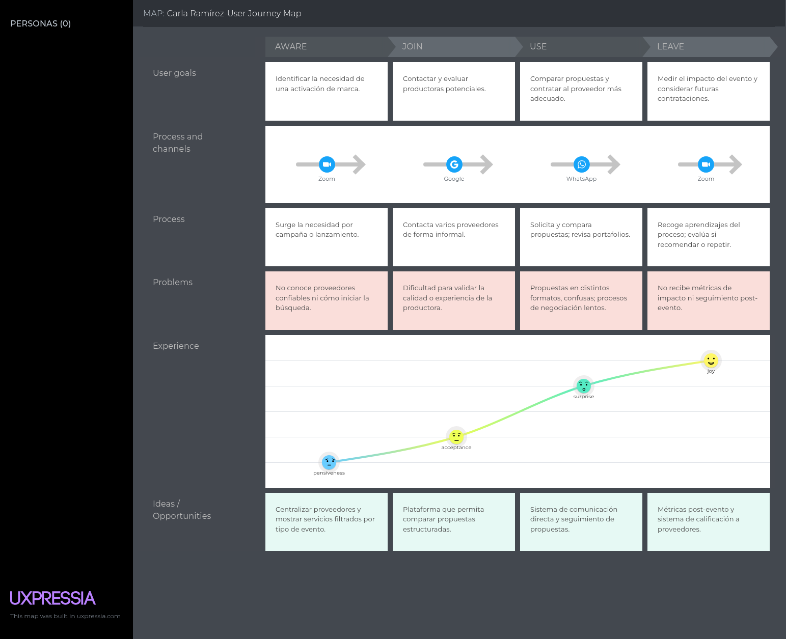


- Productoras Especializadas:
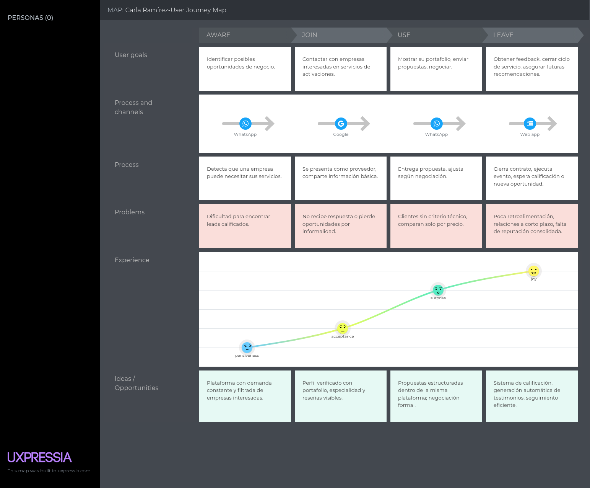

### 2.3.4. Empathy Mapping.

- Empresas o Marcas:


- Productoras Especializadas:


  
### 2.3.5. As-is Scenario Mapping.

El As-Is Scenario Mapping es una herramienta para identificar los pensamientos que tendrán los usuarios
a la hora de utilizar la aplicación actual.

- Empresas o Marcas:
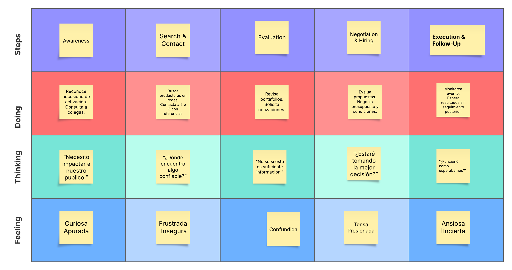

- Productoras Especializadas:
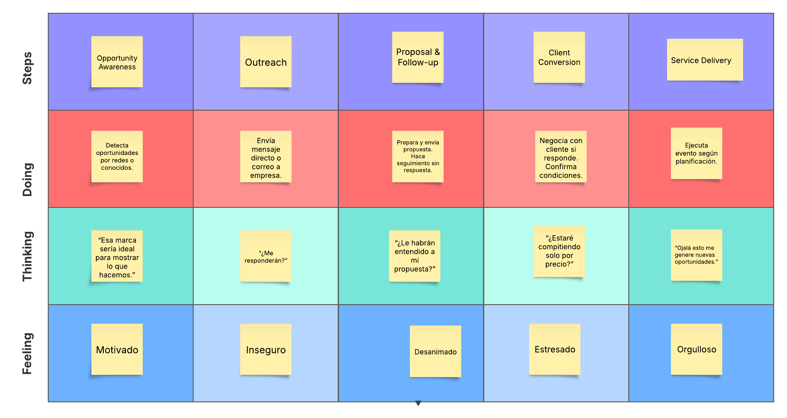
  
### 2.4. Ubiquitous Language.

Según Domain Driven Design (2019), The ubiquitous language es la descripción de conceptos y términos dentro del negocio para construir un lenguaje en 
común entre todos los implicados dentro del contexto del negocio. A continuación, se han identificado los siguientes conceptos que ayudarán a crear 
un nexo entre los usuarios y los desarrolladores:

### Ubiquitous Language – Business Domain Glossary

| **Term (English)**    | **Término (Español)**           | **Definition (Spanish)**                                                                                 |
|-----------------------|----------------------------------|-----------------------------------------------------------------------------------------------------------|
| Brand Activation      | Activación de Marca              | Conjunto de acciones que buscan generar una experiencia memorable para el consumidor y conectar emocionalmente con la marca. |
| Experiential Marketing| Marketing Experiencial           | Estrategia de marketing que busca involucrar activamente a los consumidores a través de experiencias sensoriales, emocionales o interactivas. |
| Production Company    | Productora                       | Empresa o equipo especializado en la ejecución técnica y creativa de eventos y activaciones de marca.     |
| Proposal              | Propuesta                        | Documento o presentación donde una productora describe su solución creativa y operativa para un requerimiento de activación. |
| Client Brief          | Brief del Cliente                | Documento inicial proporcionado por la empresa donde se detallan los objetivos, público objetivo, presupuesto y expectativas del evento. |
| Quote                 | Cotización                       | Estimación económica que presenta una productora para ejecutar un evento, basada en los requerimientos del cliente. |
| Portfolio             | Portafolio                       | Conjunto de trabajos anteriores que muestra la experiencia, estilo y capacidades de una productora.       |
| Lead                  | Cliente Potencial                | Empresa o persona interesada en contratar servicios para una activación o evento, que aún no ha concretado una contratación. |
| Engagement            | Interacción / Compromiso         | Grado de conexión emocional o participación que un consumidor muestra hacia una marca durante una experiencia. |
| Event Staffing        | Personal de Evento               | Equipo de trabajo contratado para ejecutar tareas específicas en un evento (anfitriones, promotores, técnicos, etc.). |


## Capítulo III: Requirements Specification
### 3.1. To-Be Scenario Mapping.
**Etapa de Preparación.**

En esta fase nos enfocamos en definir claramente el objetivo de la herramienta y comprender los perfiles clave de usuario para guiar la construcción del To-Be Scenario Mapping.

**Objetivo de la plataforma.**

Facilitar la conexión entre empresas productoras y marcas que requieren servicios de activación o eventos, centralizando el proceso de búsqueda, evaluación, contratación y gestión en un solo entorno.

**Identificación de usuarios clave:**

1. Gerente de Marketing: Publica solicitudes de eventos y contrata productoras.
   
2. Coordinador Comercial: Publica su portafolio y envía propuestas a solicitudes.

**Brainstorming inicial:**

Cada miembro del equipo propuso ideas desde la perspectiva de uno de los usuarios. Luego, se recogieron las, se analizaron y se seleccionaron las más relevantes para construir el To-Be Scenario Mapping.

**Brainstorming con perspectiva del Gerente de Marketing:**

Figura 1: Brainstorming con perspectiva del Gerente de Marketing


En esta figura el equipo realizó un brainstorming desde la perspectiva del Gerente de Marketing, identificando las necesidades y expectativas al utilizar la plataforma. Se discutieron aspectos como la facilidad de búsqueda de productoras, la evaluación de propuestas y la gestión de solicitudes.

**Brainstorming con perspectiva del Coordinador Comercial:**

Figura 2: Brainstorming con perspectiva del Coordinador Comercial


En esta figura el equipo realizó un brainstorming desde la perspectiva del Coordinador Comercial, identificando las necesidades y expectativas al utilizar la plataforma. Se discutieron aspectos como la publicación de su portafolio, el envío de propuestas y la gestión de solicitudes.

**Construcción del To-Be Scenario Mapping:**

Con base en los resultados del brainstorming, se construyó el To-Be Scenario Mapping, que representa la experiencia ideal de los usuarios al interactuar con la plataforma.

**Figura 3: To-Be Scenario Mapping Gerente de Marketing**


En esta figura, se observa el flujo de acciones del Gerente de Marketing al utilizar la plataforma. Se destacan las etapas de búsqueda de productoras, evaluación de propuestas y contratación.

**Figura 4: To-Be Scenario Mapping Coordinador Comercial**


En esta figura, se observa el flujo de acciones del Coordinador Comercial al utilizar la plataforma. Se destacan las etapas de publicación de portafolio, envío de propuestas y gestión de solicitudes.

### 3.2. User Stories.

**User Stories y Requisitos**

A continuación, se presentan los Epics y User Stories que cubren los requisitos funcionales clave del sistema, incluyendo también historias dirigidas al sitio web estático (Landing Page). Las historias están agrupadas por Epic y relacionadas con funcionalidades principales para los distintos tipos de usuario: visitantes, gerentes de marketing y coordinadores comerciales de empresas productoras.

| Epic / Story ID | Título                                          | Descripción                                                                                                                                              | Criterios de Aceptación                                                                                                                                                                                                                                                                           | Relacionado con (Epic ID) |
|-----------------|-------------------------------------------------|----------------------------------------------------------------------------------------------------------------------------------------------------------|---------------------------------------------------------------------------------------------------------------------------------------------------------------------------------------------------------------------------------------------------------------------------------------------------|---------------------------|
| EP001           | Gestión de solicitudes de activación            | Como Empresa o marca, quiero publicar una solicitud de activación para recibir propuestas de empresas productoras.                                       | - Given que el usuario es una empresa o marca autenticado, When publica una solicitud con detalles del evento, Then la solicitud queda disponible para ser vista por productoras. <br> - Given que el formulario está completo, When lo envía, Then se genera un registro con estado “pendiente”. | —                         |
| US001           | Publicar solicitud de activación                | Como Empresa o marca, quiero completar un formulario de solicitud con datos del evento.                                                                  | - Given que el usuario ha accedido a la sección de solicitudes, When completa todos los campos requeridos, Then puede enviar la solicitud correctamente. <br> - Given que la solicitud es enviada, When se publica, Then se muestra su evento para las productoras.                               | EP001                     |
| EP002           | Gestión de portafolios de servicios             | Como Productora especializada, quiero registrar los servicios de mi empresa para que las empresas que buscan activaciones puedan verlos y contratarnos.  | - Given que una productora especializada está autenticada, When accede a su perfil, Then puede crear y editar servicios disponibles. <br> - Given que un servicio es publicado, When está activo, Then es visible para empresas o marcas registradas en la plataforma.                            | —                         |
| US002           | Registrar portafolio de servicios               | Como Productora especializada, quiero poder registrar y actualizar los servicios que ofrece mi empresa.                                                  | - Given que la productora accede a la sección de portafolio, When completa la información del servicio, Then puede guardarla y publicarla.                                                                                                                                                        | EP002                     |
| EP003           | Landing Page informativa                        | Como visitante, quiero ver una página con información clara sobre la plataforma, para saber si me conviene registrarme.                                  | - Given que un visitante no autenticado entra a la landing page, When navega por la página, Then puede conocer qué es la plataforma, cómo funciona y a quién está dirigida.                                                                                                                       | —                         |
| US003           | Sección “Cómo funciona”                         | Como visitante, quiero entender el funcionamiento general de la plataforma desde la landing page.                                                        | - Given que estoy en la landing page, When veo la sección “Cómo funciona”, Then comprendo el flujo entre empresas y productoras.                                                                                                                                                                  | EP003                     |
| US004           | Sección de beneficios para empresas productoras | Como visitante del segmento Productoras especializadas**, quiero leer los beneficios de unirme a la plataforma.                                          | - Given que ingreso como visitante, When navego a la sección de beneficios para productoras, Then entiendo las ventajas de registrarme como proveedor de servicios de activación.                                                                                                                 | EP003                     |
| US005           | Sección de beneficios para marcas               | Como visitante del segmento Empresa o marca**, quiero conocer los beneficios de publicar mis necesidades en la plataforma.                               | - Given que soy un visitante interesado en contratar servicios, When leo la sección dirigida a empresas o marcas, Then comprendo por qué la plataforma me ayuda a encontrar proveedores confiables.                                                                                               | EP003                     |
| US006           | Sección de pie de página (footer)               | Como visitante, quiero acceder desde el footer a información adicional como contacto, redes sociales y políticas.                                        | - Given que estoy navegando por la landing page, When llego al pie de página, Then puedo acceder a enlaces útiles como contacto, redes sociales y términos legales.                                                                                                                               | EP003                     |
| US007           | Sección “¿Quiénes somos?”                       | Como visitante, quiero conocer quién está detrás de la plataforma, para confiar en su propuesta.                                                         | - Given que soy un visitante, When visualizo la sección “¿Quiénes somos?”, Then entiendo el propósito, visión y respaldo de la plataforma.                                                                                                                                                        | EP003                     |
| US008           | Llamado a la acción (Call to Action)            | Como visitante, quiero ver un botón claro que me invite a acceder a la app web.                                                                          | - Given que estoy explorando la landing page, When veo el botón de llamado a la acción, Then puedo ir directamente al registro o login de la plataforma.                                                                                                                                          | EP003                     |
| EP004           | Personalización según rol del usuario           | Como usuario de la plataforma, quiero que la experiencia se adapte a mi rol, para acceder solo a funcionalidades relevantes para mí.                     | - Given que el usuario está registrado, When inicia sesión, Then la plataforma muestra vistas y funciones relevantes según su tipo de cuenta.                                                                                                                                                     | —                         |
| US008           | Selección de tipo de perfil al registrarse      | Como nuevo usuario, quiero seleccionar si soy una Empresa o marca o una Productora especializada.                                                        | - Given que soy un usuario nuevo, When completo mi registro, Then debo seleccionar mi tipo de cuenta antes de continuar.                                                                                                                                                                          | EP004                     |
| US009           | Vista principal para productoras                | Como Productora especializada, quiero ver al iniciar sesión una lista de solicitudes de activación.                                                      | - Given que soy una productora autenticada, When accedo a la plataforma, Then visualizo solicitudes activas de empresas.                                                                                                                                                                          | EP004                     |
| US010           | Vista principal para empresas                   | Como Empresa o marca, quiero ver al iniciar sesión perfiles de productoras, para explorar y seleccionar posibles proveedores.                            | - Given que soy una empresa autenticada, When accedo a la plataforma, Then visualizo perfiles de productoras especializadas disponibles.                                                                                                                                                          | EP004                     |
| US011           | Historial de solicitudes de activación          | Como Empresa o marca, quiero ver mis solicitudes pasadas y en curso, para hacer seguimiento y gestionar mis eventos.                                     | - Given que soy una empresa con solicitudes creadas, When accedo a “Mis activaciones”, Then puedo ver un listado con estado y detalles.                                                                                                                                                           | EP004                     |
| US012           | Seguimiento de eventos contratados              | Como Productora especializada, quiero acceder a una sección con las activaciones en las que estoy trabajando.                                            | - Given que fui contratada para eventos, When accedo a “Mis activaciones”, Then visualizo los detalles de cada evento.                                                                                                                                                                            | EP004                     |
| US013           | Contactar a productora desde su perfil          | Como Empresa o marca, quiero poder contactar a una productora desde su perfil, para coordinar los detalles de una posible contratación.                  | - Given que soy una empresa autenticada, When visualizo el perfil de una productora, Then puedo acceder a una opción para iniciar contacto. - Given que inicio un contacto, When la productora recibe la solicitud, Then ambas partes podemos iniciar una negociación.                            | EP004                     |
| US014           | Contactar a empresa desde una solicitud         | Como Productora especializada, quiero poder contactar a una empresa desde su solicitud de activación, para ofrecer mis servicios y obtener más detalles. | - Given que soy una productora autenticada, When visualizo una solicitud publicada, Then puedo acceder a una opción para iniciar contacto con la empresa. <br> - Given que inicio un contacto, When la empresa recibe la solicitud, Then ambas partes podemos iniciar una negociación.            | EP004                     |
| US015           | Sistema de mensajería interna                   | Como usuario autenticado, quiero contar con una mensajería dentro de la plataforma, para comunicarme con otras empresas de forma segura y centralizada.  | - Given que estoy autenticado, When accedo a una conversación activa, Then puedo enviar y recibir mensajes. <br> - Given que recibo un nuevo mensaje, When ingreso a la plataforma, Then puedo ver notificaciones en tiempo real o al iniciar sesión.                                             | EP004                     |

**Épicas**

| Epic ID | Título                                      |
|---------|----------------------------------------------|
| EP001   | Gestión de solicitudes de activación        |
| EP002   | Gestión de portafolios de servicios         |
| EP003   | Landing Page informativa                    |
| EP004   | Personalización según rol del usuario      |

### 3.3. Impact Mapping.

En esta sección se presenta el Impact Mapping realizado para nuestros dos user personas previamente definidos: el Gerente de Marketing de una empresa o marca, y el Coordinador Comercial de una empresa productora de eventos.

**Figura 5: Impact Mapping**


Esta figura muestra el Impact Mapping en el cual se definieron tres Business Goals SMART: (1) alcanzar 600 usuarios registrados en 8 meses, (2) lograr que el 50% de las empresas publiquen una solicitud dentro de los primeros 10 días, y (3) conseguir que el 60% de las productoras activas generen al menos un contrato en los primeros 4 meses. Además, se identificaron las acciones que deben realizar para alcanzar estos objetivos.

### 3.4. Product Backlog.

En esta sección se presenta el Product Backlog, que incluye las historias de usuario priorizadas y sus respectivas estimaciones de esfuerzo. El backlog está organizado por User Stories, y cada historia tiene asignada una estimación en puntos de historia para facilitar la planificación de sprints.

| Orden | User Story Id | Título                                  | Descripción                                                                                             | Story Points |
|-------|---------------|-----------------------------------------|---------------------------------------------------------------------------------------------------------|--------------|
| 1     | US003         | Sección “Cómo funciona”                 | Como visitante, deseo entender el funcionamiento general de la plataforma desde la landing page.        | 2            |
| 2     | US004         | Beneficios para empresas productoras    | Como visitante del segmento productora, deseo leer los beneficios de unirme a la plataforma.            | 2            |
| 3     | US005         | Beneficios para marcas                  | Como visitante del segmento marca, deseo conocer los beneficios de publicar mis necesidades.            | 2            |
| 4     | US007         | ¿Quiénes somos?                         | Como visitante, deseo conocer quién está detrás de la plataforma para confiar en su propuesta.          | 1            |
| 5     | US008         | Call to Action                          | Como visitante, deseo ver un botón claro que me invite a acceder a la app web.                          | 1            |
| 6     | US006         | Footer de la landing                    | Como visitante, deseo acceder desde el footer a información como contacto y políticas.                  | 1            |
| 7     | US008         | Selección de tipo de perfil             | Como nuevo usuario, deseo seleccionar si soy una empresa productora o una empresa que solicita eventos. | 3            |
| 8     | US009         | Vista de solicitudes (productora)       | Como productora, deseo ver una lista de solicitudes de activación para identificar oportunidades.       | 5            |
| 9     | US010         | Vista de perfiles (empresa solicitante) | Como empresa, deseo ver perfiles de productoras disponibles para contratarlas.                          | 5            |
| 10    | US011         | Historial de solicitudes                | Como empresa, deseo ver mis solicitudes pasadas y en curso para hacer seguimiento.                      | 3            |
| 11    | US012         | Seguimiento de eventos contratados      | Como productora, deseo acceder a mis eventos en curso para organizarlos.                                | 3            |
| 12    | US013         | Contactar a productora                  | Como empresa o marca, deseo contactar a una productora desde su perfil para coordinar una contratación. | 3            |
| 13    | US014         | Notificaciones de solicitudes           | Como empresa, deseo recibir notificaciones cuando una productora responda a mi solicitud.               | 2            |
| 14    | US015         | Notificaciones de contratación          | Como productora, deseo recibir alertas cuando soy contratada para un evento.                            | 2            |
| 15    | US002         | Registrar portafolio de servicios       | Como productora, deseo registrar y actualizar los servicios que ofrece mi empresa.                      | 3            |


# **Capítulo IV: Product Design**

## **4.1. Style Guidelines.**

### **4.1.1. General Style Guidelines.**

**Branding:**

Para el diseño del logotipo, se utilizaron los colores base de la paleta principal, buscando transmitir profesionalismo y confianza. Se incorporó un ícono relacionado con la organización de eventos para reforzar visualmente la esencia del servicio. La tipografía fue elegida por su legibilidad y estilo moderno, alineándose con la identidad tecnológica y formal del proyecto.

 

 

 

Hemos considerado diseñar el logotipo tanto para el modo claro y el modo oscuro, los cuales cuentan con los colores principales de cada modo.

**Colors:**

Dado que el proyecto está orientado a conectar empresas con productoras especializadas en activaciones de marca, se seleccionó una paleta de colores que refleje profesionalismo, dinamismo y confianza. Los tonos fueron elegidos cuidadosamente para mantener una estética formal, moderna y funcional tanto en modo claro como en modo oscuro, asegurando una experiencia visual agradable y coherente en el aplicativo web.

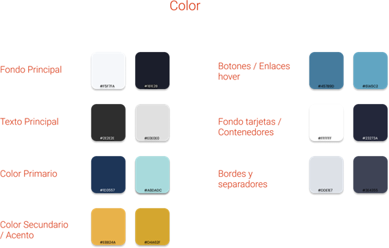

En el modo claro, predominan tonos suaves como el gris muy claro (#F5F7FA) y el blanco (#FFFFFF) para los fondos, lo que genera una sensación de limpieza y claridad. El azul profundo (#1D3557), como color primario, representa tecnología y seriedad, mientras que el mostaza suave (#E8B24A) aporta un toque moderno y distintivo sin saturar visualmente. Los acentos en celeste tenue (#457B9D) refuerzan la interacción del usuario, guiándolo sin ser invasivos.

Por otro lado, en el modo oscuro se utilizaron colores que brindan descanso visual, como el azul gris oscuro (#1B1E2B) para el fondo y el gris claro (#E0E0E0) para los textos. El azul suave (#A8DADC) conserva el enfoque tecnológico, pero adaptado a un entorno nocturno, y el mostaza apagado (#D4A62F) mantiene el equilibrio entre sobriedad y acento visual. Estos colores buscan asegurar una experiencia accesible, elegante y funcional en cualquier contexto de uso.

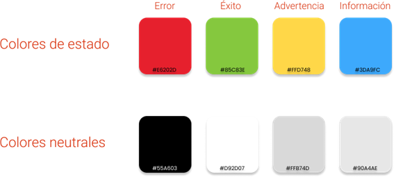  
Además tenemos a los colores de estado, los cuales nos permiten comunicar situaciones clave dentro del sistema de forma visual e intuitiva. El rojo se utiliza para errores o alertas críticas, el verde indica acciones exitosas, el amarillo señala advertencias o validaciones pendientes, y el azul (opcional) puede emplearse para mensajes informativos.
Acompañan estos, los colores neutros como el blanco, el negro y los grises, que aportan equilibrio visual y ayudan a jerarquizar los contenidos sin distraer la atención del usuario
 

**Spacing:**

Se ha adoptado un sistema de espaciado modular basado en múltiplos de 4 píxeles (4px, 8px, 12px, 16px, 32px, etc.) con el fin de mantener una estructura visual limpia, ordenada y coherente en toda la interfaz. Esta decisión facilita la alineación precisa entre elementos, mejora la legibilidad del contenido y refuerza la jerarquía visual, permitiendo que la información fluya de forma natural. Al aplicar estas unidades de manera sistemática, se optimiza también la escalabilidad del diseño, haciendo que la interfaz pueda adaptarse fácilmente a diferentes tamaños de pantalla sin perder equilibrio ni armonía visual.

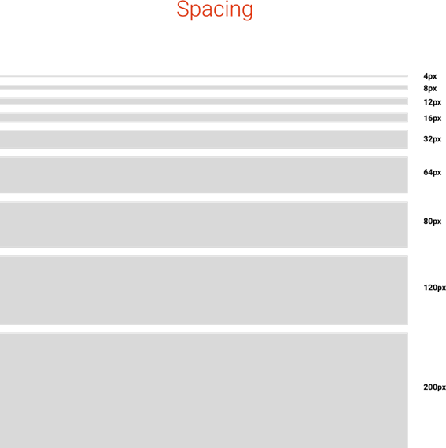  

**Dimensions:**

Para las dimensiones dentro del proyecto, se ha definido un enfoque que prioriza tanto la accesibilidad como la experiencia de usuario. Los elementos interactivos clave, como botones o campos de formulario, cuentan con dimensiones generosas que facilitan su interacción, especialmente en dispositivos táctiles. Se busca que todos los componentes sean fácilmente identificables y utilizables, reduciendo errores y mejorando la eficiencia al navegar.

El diseño es completamente responsivo, lo que permite que los elementos se ajusten automáticamente al tamaño de pantalla del dispositivo utilizado, ya sea móvil, tablet o escritorio. Imágenes y contenedores mantienen proporciones flexibles para asegurar una correcta visualización sin distorsión. Además, se emplean puntos de quiebre estratégicos (breakpoints) que adaptan las dimensiones de la interfaz para mantener un equilibrio visual y funcional en todo momento.

**Typography:**

Para este proyecto se ha elegido la tipografía Roboto, una fuente sans-serif moderna, versátil y altamente legible que se adapta muy bien a entornos digitales. Su diseño limpio y neutral permite una lectura fluida tanto en pantallas grandes como en dispositivos móviles, lo que la convierte en una excelente opción para interfaces enfocadas en la usabilidad.

Se emplean distintos pesos tipográficos (regular, medium y bold) para jerarquizar correctamente la información y guiar la atención del usuario de forma clara y coherente. Los títulos utilizan un peso más fuerte y tamaños mayores para destacar las secciones importantes, mientras que los textos secundarios y descriptivos mantienen un peso ligero para evitar la sobrecarga visual.

Además, se ha cuidado el interlineado y el espaciado entre caracteres para asegurar una buena legibilidad, especialmente en bloques de texto extensos o formularios. La elección de Roboto no solo responde a una cuestión estética, sino también funcional: mejora la accesibilidad, es compatible con múltiples navegadores y dispositivos, y aporta una sensación profesional y contemporánea a toda la interfaz. 


### **4.1.2. Web Style Guidelines.**

**Buttons:** 

En el desarrollo del proyecto se utilizarán componentes de Angular Material para la implementación de los botones, lo que garantiza consistencia, accesibilidad y buenas prácticas en diseño UI. Los botones adoptarán un estilo con bordes ligeramente redondeados para transmitir una apariencia moderna y amigable, alineada con la estética general de la plataforma.

La paleta de colores personalizada se aplicará a los distintos estados y jerarquías de los botones: el color primario se usará para las acciones principales, mientras que el color secundario servirá de soporte en acciones complementarias. Además, se incluirán efectos de hover y focus con tonos suaves derivados de la paleta, mejorando la retroalimentación visual durante la interacción.

Se mantendrá una proporción adecuada entre tamaño de texto, padding y altura de los botones para asegurar que sean fácilmente clickeables, tanto en pantallas grandes como en dispositivos móviles. Este enfoque busca facilitar la navegación, guiar la acción del usuario y mantener la coherencia visual en toda la interfaz.

  

**Icons:** 

En el desarrollo de la plataforma se emplearán íconos del sistema Material Icons, integrados mediante Angular Material, lo que garantiza compatibilidad, accesibilidad y consistencia visual en toda la interfaz. Estos íconos siguen un estilo sencillo y geométrico, ideal para complementar un diseño limpio, moderno y funcional.

Se priorizará el uso de íconos que refuercen el significado de botones y acciones clave dentro de la aplicación, permitiendo al usuario identificar funcionalidades de forma intuitiva. Además, se adaptarán a la paleta de colores del sistema para mantener una coherencia estética, evitando distracciones o rupturas visuales dentro del flujo de navegación.

Su aplicación estará presente en áreas como navegación, formularios, estados del sistema y acciones secundarias, buscando siempre que los elementos visuales aporten valor informativo sin recargar la interfaz. Esto permitirá mejorar la experiencia de usuario mediante una comunicación visual clara y efectiva.

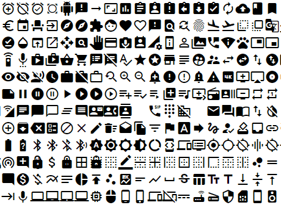 

## **4.2. Information Architecture.**

### **4.2.1. Organization Systems.**  
Considerando que somos estudiantes, decidimos adoptar un formato jerárquico estándar, parecido al enfoque organizativo que podemos encontrar en gran cantidad de páginas web. Esto aplica para:

**Landing page**: Donde se presenta las principales características que tiene el aplicativo web, orientado a los dos segmentos objetivos. Este contará con una sección de inicio, Features, About us y Contact Us.

**Web Application**: Donde se brinda acceso a los dos segmentos objetivos, para que puedan buscar y generar contactos entre ambos, para el desarrollo de sus eventos/activaciones.

### 4.2.2. Labeling Systems.
En esta sección se explicará como se representará la información de la Landing Page de nuestra startup con una organización clara y concisa.

**Principios de etiquetado:**
 - Simplicidad: Buscaremos que las etiquetas tengan nombres entendibles y cortos para que se entienda claramente la información de cada una.
 - Claridad: El nombre de las etiquetas deben ser claras y fácil de entender, para que transmitan rápidamente la función de la etiqueta.
**Etiquetas y asociaciones**
 - Header: Será el encabezado de la página que contendrá el logo de nuestra startup y el sistema de navegación de la landing page como por ejemplo "Contacto" o "Planes".
 - Secciones: Habrán secciones para cada tipo de información, como por ejemplo la sección relacionada a la información de la startup, la sección de contacto, planes y características.
 - Call to Action:
   - Botones: Algunos botones llevarán a otras partes de la Landing Page, como por ejemplo un botón de "Descubre más" que lleve a la sección de Contactos.
   - Links: La Landing Page tendra links entre secciones del menu de navegación para que al dar clicks a esas opciones, nos lleve a ciertas partes. Por ejemplo, que al darle click a la opción "Sobre     nosotros", te lleve a la sección de información de la startup. También, se puede crear links a redes sociales a través de un SVG o PNG de cada red social.
 - Footer: El pie de página se encargará de contener información como algunas redes sociales de la startup, preguntas frecuentes, número de contacto, etc.
### 4.2.3. SEO Tags and Meta Tags
Los SEO Tags y Meta Tags son sumamente importantes para la aplicación y landing page ya que hará que resalte ante otras páginas a la hora de realizar búsquedas a través de los browser.

 - **Title tag:** 
   - Valor: "MatchEvent - Conecta Marcas con Productoras de Eventos"
   - Descripción: Un título corto que describe la funcionalidad de la página.
     
 - **Meta tag:**
   - Valor: "MatchEvent es una aplicación que ayuda a que productoras de eventos puedan brindar sus servicios a empresas y marcas. Además, esetas empresas pueden contactar con las productoras en caso requieran mayor información."
   - Descripción: Proporciona una mayor descripción al Title Tag, especificando un poco más las características de la startup y como puede influir positivamente.
     
 - **Meta keywords:**
   -Valor: "Gestionar eventos, servicio para empresas, activaciones de marka, marketing, productoras de eventos, organización de eventos."
   -Descripción: Algunas palabras claves que dan a entender las funcionalidades o lo que desea cumplir la aplicación.
  
 - **Meta author:**
   - Valor: "CloseSource"
   - Descripción: El nombre del autor, en este caso, el autor detrás de MatchEvent que es CloseSource.
     
 - **Meta robots:**
   - Valor: "index, follow"
   - Descripción: Son importantes para decirle a los motores de búsqueda cómo deben indexar o no indexar tu página y si deben seguir los enlaces que hay en ella.
### 4.2.4. Searching Systems.

En esta sección se explica qué medios de ayuda se brindará al usuario para la búsqueda de datos dentro del producto digital. En este caso, nos centraremos en la Landing Page.

  - **Sistema de búsqueda de la Landing Page:**
  
    - Menú de navegación: La Landing Page contará con un menu de navegación en el header o encabezado que mostrará cada sección que se mostrará en la pagina web. Al darle click a cada link, este te llevará a su respectiva sección.
    
    - Enlaces internos: Habrán enlaces internos tanto en el header como en el footer, que se encargarán de llevar al usuario a diversas partes de la landing page o a lugares externos, como por ejemplo, un link a la red social de la startup.
    
    - Palabras destacadas: Algunas palabras estarán resaltadas en negrita o con un tamaño de letra más grande, que resaltará palabras clave.
    - 
### 4.2.5. Navigation Systems.
En esta sección se explicará cuáles serán las acciones y técnicas que guiarán a los usuarios a través del Landing Page y las aplicaciones, permitiéndoles cumplir sus metas e interactuar de forma satisfactoria con el producto.
  - **Sistemas de navegación para la Landing Page**
    - Menu de navegación: El menú de navegación que se encontrará al inicio de la página permitirá ver que secciones tendrá la Landing Page, cada sección tendra un link que hará que el usuario pueda ir a cada una de estas unicamente dando click.
    - Botones: Se utilizarán botones destacados de llamados a la acción (CTA's) para algunas acciones, como por ejemplo, habrá un botón de "Registrate" el cual llevará al usuario a un formulario el cual le permitira iniciar sesión o registrarse.
    - Diseño por secciones: La Landing Page se dividirá en secciones la cual cada una se encargará de proporcionar un tipo de información. Por ejemplo, en una sección se mostrará toda la información acerca de la startup, otra sobre las características, planes, contacto, etc.
  - **Sistemas de navegación para la aplicación web**
    - Barra de navegación: La aplicación contará con una barra de navegación para que las empresas o usuarios busquen a el productor que ellos deseen y que se adapte más a sus necesidades. Además, los productores también podrán buscar empresas y marcas que necesiten de un servicio para así poder enviar su solicitud para brindar su servicio.
    - Navegación basada en tipo de usuario: Dependiendo de la clase de usuario que se desee ser (empresa o productora), las funciones de la aplicación variarán ya que cada uno de los segmentos objetivos demandan un objetivo diferente.
    - Ayuda contextual: Se presentará un mini tutorial sobre el uso de la aplicación web para ayudar al usuario a poder entender el funcionamiento de la app.
### 4.3. Landing Page UI Design.
### 4.3.1. Landing Page Wireframe.
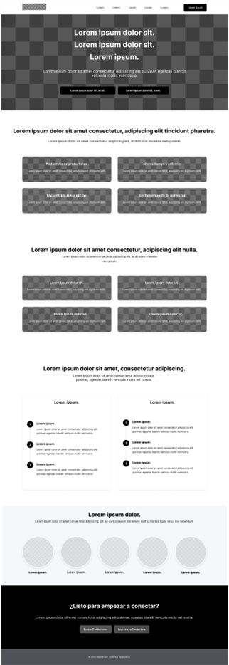
### 4.3.2. Landing Page Mock-up.

### 4.4. Web Applications UX/UI Design.
### 4.4.1. Web Applications Wireframes.


### 4.4.2. Web Applications Wireflow Diagrams.
### 4.4.2. Web Applications Mock-ups.


### 4.4.3. Web Applications User Flow Diagrams.

### 4.5. Web Applications Prototyping.
### 4.6. Domain-Driven Software Architecture.
Domain-Driven software architecture es un enfoque de diseño de software que se centra en la creación de un modelo conceptual del dominio del problema, permitiendo una mejor comprensión y comunicación entre los desarrolladores y los expertos en el dominio. Este enfoque ayuda a alinear el diseño del software con las necesidades del negocio y a crear una arquitectura más flexible y mantenible.
MatchEvent es un ejemplo de una aplicación web que utiliza este enfoque, permitiendo a las empresas y productoras gestionar sus eventos de manera eficiente.
### 4.6.1. Software Architecture Context Diagram.
Elementos en el diagrama de contexto:
- MatchEvent: Aplicación web que conecta empresas y productoras.
- Visitor: Usuario no autenticado que navega por la landing page.
- Customer: Empresa o marca que publica solicitudes de activación o compañía productora que publica su portafolio.

**Figura 6: Software Architecture Context Diagram**


### 4.6.2. Software Architecture Container Diagrams.
Elementos en el diagrama de contenedores:
- Web Application: Aplicación web que permite a los usuarios interactuar con la plataforma.
- Database: Base de datos que almacena la información de los usuarios, solicitudes y servicios.
- Backend API: API que gestiona la lógica de negocio y la comunicación entre la aplicación web y la base de datos.
- Landing Page: Página de inicio que proporciona información sobre la plataforma y permite a los usuarios registrarse o iniciar sesión.
- Developer: Desarrollador que trabaja en la implementación y mantenimiento de la aplicación.
- Visitor: Usuario no autenticado que navega por la landing page.
- Customer: Empresa o marca que publica solicitudes de activación o compañía productora que publica su portafolio.

**Figura 7: Software Architecture Container Diagrams**


### 4.6.3. Software Architecture Components Diagrams.
**Bounded Context Identity and Access:**

Elementos en el diagrama de componentes:
- Web Application: Aplicación web que permite a los usuarios interactuar con la plataforma.
- User Controller: Controlador que gestiona las solicitudes de los usuarios y la autenticación.
- User Service: Servicio que maneja la lógica de negocio relacionada con los usuarios.
- User Repository: Repositorio que interactúa con la base de datos para almacenar y recuperar información de los usuarios.
- Database: Base de datos que almacena la información de los usuarios, solicitudes y servicios.

**Figura 8: Bounded Context Identity and Access**


**Bounded Context Activation Request**

Responsabilidad:

- Creación de solicitudes de activación
- Edición o eliminación
- Listado de solicitudes
- Visualización de detalles de una solicitud

**Figura 9: Bounded Activation Request** 


**Bounded Context Activation Quotes**

Responsabilidad:
- Permitir a una productora enviar una propuesta para una solicitud publicada.
- Listar propuestas enviadas por cada productora.
- Posible relación con estados: "enviada", "aceptada", "rechazada".

**Figura 10: Bounded Context Activation Quotes**


**Bounded Context Activation Management**

Responsabilidad:

- Ver el historial de activaciones (mis activaciones)
- Ver detalles de cada activación.
- Cambiar estado: "en curso", "finalizada", "cancelada".

**Figura 11: Bounded Context Activation Management**


**Bounded Context Portafolio Management**

Responsabilidad:
- Permitir a una productora registrar y editar su portafolio de servicios.
- Cada servicio podría tener: nombre, descripción, categoría, precio, etc.
- Mostrar estos servicios como parte del perfil público de la productora.

**Figura 12: Bounded Context Portafolio Management**


**Bounded Context Providers**

Responsabilidad:

- Buscar productoras por nombre, categoría, tags, ubicación, etc.
- Visualizar perfil público de una productora
- Filtros

**Figura 13: Bounded Context Providers**


### 4.7. Software Object-Oriented Design.

#### 4.7.1. Class Diagrams.


#### 4.7.2. Class Dictionary

A continuación, se presenta el diccionario de clases correspondiente al modelo de datos de la aplicación MatchEvent. Esta sección describe cada clase identificada en el diagrama de clases, incluyendo sus atributos y relaciones con otras entidades.

---

### 📦 Empresa
- **Descripción**: Representa a una marca o compañía que solicita servicios de activación de eventos.
- **Atributos**:
  - `id_empresa: int` – Identificador único de la empresa.
  - `ruc: string` – Registro Único de Contribuyente.
  - `razon_social: string` – Nombre legal de la empresa.
- **Relaciones**:
  - Tiene múltiples contactos (`Contacto`).
  - Negocia con múltiples usuarios (`Usuario`).

---

### 🎥 Productora
- **Descripción**: Empresa o equipo encargado de ofrecer servicios de producción de eventos.
- **Atributos**:
  - `id_productora: int` – Identificador único.
  - `nombre_comercial: string` – Nombre comercial.
  - `especialidad: string` – Tipo de eventos que realiza.
- **Relaciones**:
  - Ofrece uno o más `Servicio`.

---

### 👤 Usuario
- **Descripción**: Persona que interactúa con la plataforma, ya sea como empresa o como productora.
- **Atributos**:
  - `id_usuario: int`
  - `nombre: string`
  - `correo: string`
  - `contrasena: string`
  - `tipo_usuario: string` – Puede ser "empresa" o "productora".
- **Relaciones**:
  - Crea solicitudes (`SolicitudActivacion`).
  - Envía y recibe mensajes (`Mensaje`).
  - Puede emitir y recibir calificaciones (`Calificacion`).

---

### 🤝 Contacto
- **Descripción**: Representa una relación de comunicación entre una empresa y una productora.
- **Atributos**:
  - `id_contacto: int`
  - `fecha_inicio: date`
  - `estado_contacto: bool` – Indica si el contacto está activo o no.
- **Relaciones**:
  - Contiene múltiples `Mensaje`.

---

### 💬 Mensaje
- **Descripción**: Comunicación entre dos usuarios dentro de un contacto.
- **Atributos**:
  - `id_mensaje: int`
  - `contenido: string`
  - `fecha_inicio: datetime`
  - `visto: bool`
- **Relaciones**:
  - Pertenece a un `Contacto`.

---

### 📄 SolicitudActivacion
- **Descripción**: Requerimiento de una empresa para la organización de un evento.
- **Atributos**:
  - `id_solicitud: int`
  - `titulo_evento: string`
  - `descripcion_evento: string`
  - `ubicacion: geography`
  - `fecha_inicio: date`
  - `fecha_fin: date`
  - `estado: string`
- **Relaciones**:
  - Recibe múltiples `Propuesta`.

---

### 🛠️ Servicio
- **Descripción**: Servicio que una productora ofrece dentro de la plataforma.
- **Atributos**:
  - `id_servicio: int`
  - `nombre: string`
  - `descripcion: string`
  - `precio: money`
- **Relaciones**:
  - Puede ser referenciado por múltiples `Propuesta`.

---

### 📦 Propuesta
- **Descripción**: Oferta enviada por una productora en respuesta a una solicitud de activación.
- **Atributos**:
  - `id_propuesta: int`
  - `descripcion: string`
  - `precio_ofertado: float`
  - `fecha_envio: datetime`
  - `estado_propuesta: string`
- **Relaciones**:
  - Referencia un `Servicio`.
  - Genera un `Evento`.

---

### 🎉 Evento
- **Descripción**: Activación de marca confirmada que se ejecutará en una fecha determinada.
- **Atributos**:
  - `id_evento: int`
  - `fecha_inicio: datetime`
  - `fecha_fin: datetime`
  - `estado: string`
  - `calificacion: string`
- **Relaciones**:
  - Recibe una o más `Calificacion`.

---

### ⭐ Calificacion
- **Descripción**: Valoración que un usuario hace sobre la experiencia de un evento.
- **Atributos**:
  - `id_calificacion: int`
  - `puntuacion: float`
  - `comentario: string`
- **Relaciones**:
  - Asociada a un `Evento`.
  - Tiene un `emisor` y un `receptor` (`Usuario`).

---

### 4.8. Database Design

#### 4.8.1 Database Diagram

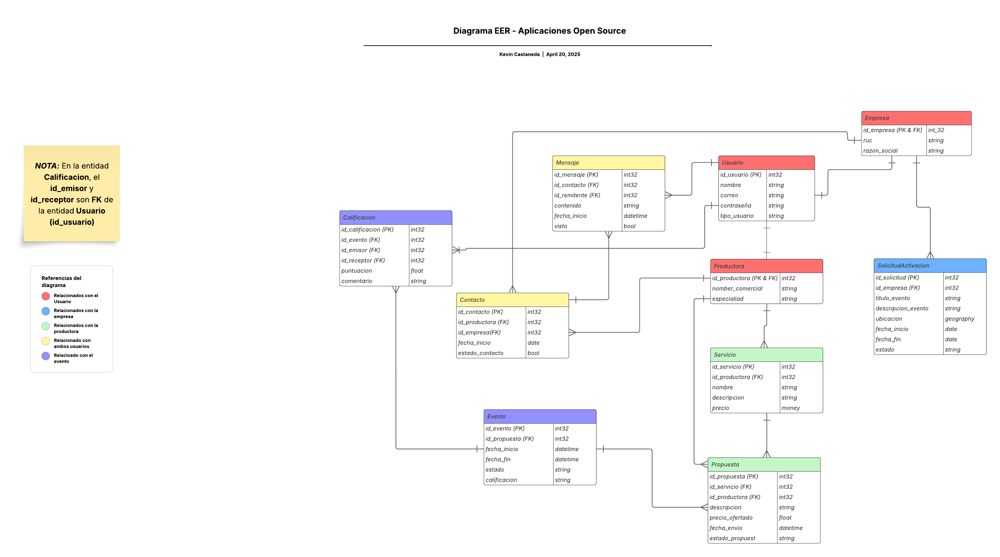

# Capítulo V: Product Implementation, Validation & Deployment.

## 5.1. Software Configuration Management.

### 5.1.1. Software Development Environment Configuration.

- **UXPRESSIA:** UXPressia es una plataforma especializada en la creación de herramientas visuales orientadas al diseño centrado en el usuario. Permite desarrollar mapas de experiencia del cliente, diagramas de flujo, mapas de sitio y otros recursos clave para entender y optimizar la interacción entre los usuarios y un producto o servicio. En nuestro proyecto, utilizaremos UXPressia para mapear la experiencia de los diferentes usuarios que interactúan con la plataforma, identificando sus necesidades, puntos de dolor y oportunidades de mejora.
  
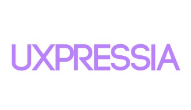

- **Figma:** Figma es una herramienta de diseño colaborativo basada en la web, enfocada en la creación de interfaces gráficas y experiencias de usuario (UI/UX). Su entorno en línea permite que múltiples diseñadores trabajen simultáneamente en un mismo archivo, lo que mejora la colaboración en tiempo real. En el contexto de nuestro proyecto, usaremos Figma para diseñar las pantallas, los prototipos interactivos y la interfaz visual del producto, asegurando que cumpla con criterios de usabilidad y estética.

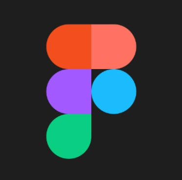
  
- **Miro:**  Miro es un tablero digital colaborativo que facilita la organización visual de ideas, flujos de trabajo, mapas mentales y diagramas. Se utiliza comúnmente en sesiones de brainstorming, planificación ágil, workshops y diseño de productos. Para nuestro proyecto, emplearemos Miro en las etapas iniciales para conceptualizar la estructura general, visualizar procesos, y organizar ideas clave entre los miembros del equipo. También lo usaremos para documentar decisiones importantes a lo largo del desarrollo.


#### Software Development

- **(IDE)s**

**Visuals Studio Code:** Se trata de un editor de texto multiplataforma y de código abierto creado por Microsoft, ampliamente utilizado en la comunidad de desarrollo. Soporta múltiples lenguajes de programación y cuenta con una gran cantidad de extensiones que facilitan y enriquecen el entorno de trabajo del programador. En el proyecto, utilizamos esta herramienta tanto para construir la landing page como para redactar la documentación en archivos con formato “.md”.


**WebStorm:** Es un entorno de desarrollo integrado (IDE) desarrollado por JetBrains, especialmente orientado al desarrollo frontend. Ofrece herramientas potentes y características inteligentes para trabajar eficientemente con tecnologías web como HTML, CSS y JavaScript, lo que facilita la creación y mantenimiento de interfaces dinámicas y modernas.

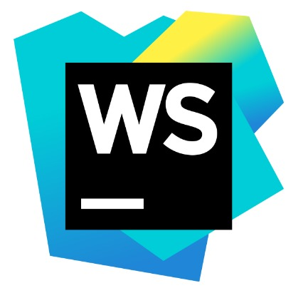

- **HTML5:** Es la quinta y más actualizada versión del lenguaje de marcado utilizado para estructurar el contenido en la web. Introduce nuevas etiquetas semánticas, soporte multimedia nativo y mejoras en la interoperabilidad con otras tecnologías web. Estas características lo convierten en una herramienta esencial para el desarrollo de sitios web modernos y responsivos.


- **CSS3:** Es la última evolución del lenguaje de hojas de estilo en cascada (Cascading Style Sheets), empleado para definir la apariencia visual de los sitios web. Incorpora funcionalidades avanzadas como animaciones, transiciones, gradientes y media queries, lo que permite crear interfaces más atractivas, dinámicas y adaptables a diferentes dispositivos. Es una pieza clave en el desarrollo de experiencias web modernas.

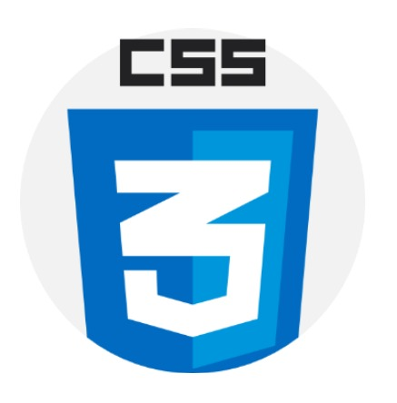

- **AngularJS:** Es un framework de desarrollo web basado en JavaScript y mantenido por Google, diseñado para facilitar la creación de aplicaciones de una sola página (SPA). Proporciona una arquitectura robusta que permite gestionar componentes reutilizables, el enrutamiento entre vistas, y la integración con servicios backend. Gracias a su enfoque modular y su sistema de enlace de datos, es ampliamente utilizado para construir interfaces interactivas y escalables.

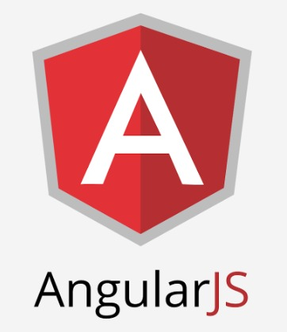

- **JS:** JavaScript es un lenguaje de programación esencial en el desarrollo web, utilizado para dotar de interactividad y dinamismo a sitios y aplicaciones en línea. Permite manipular el contenido de la página en tiempo real, responder a acciones del usuario, validar formularios, y mucho más. Su versatilidad lo convierte en una herramienta clave tanto en el frontend como en el backend de aplicaciones modernas.


### 5.1.2. Source Code Management.

Creamos una organización en Github con todos los miembros del grupo, y dentro de esta creamos un repositorio para cada parte del proyecto, siendo:

| **Segmento** | **URL** |
|-----------|-----------| 
| Organización | https://github.com/UPC-PRE-SI729-2510-4341-G2-CloseSource| 
|Report|https://github.com/UPC-PRE-SI729-2510-4341-G2-CloseSource/Report| 
| Repositorio Landing Page| https://github.com/UPC-PRE-SI729-2510-4341-G2-CloseSource/Landing-Page | 
| Backend | https://github.com/UPC-PRE-SI729-2510-4341-G2-CloseSource/Backend |
| Frontend | https://github.com/UPC-PRE-SI729-2510-4341-G2-CloseSource/Frontend |


**GitFlow Implementation:**

GitFlow es una estrategia estructurada para el control de versiones en Git, que establece un flujo de trabajo claro mediante la organización de ramas. Bajo este modelo, la rama develop sirve como base para integrar nuevas funcionalidades en desarrollo, mientras que la rama main almacena la versión estable del proyecto, lista para ser desplegada, en este caso, a través de GitHub Pages. Además, se crean ramas específicas para cada funcionalidad o tarea (feature), lo cual permite trabajar de forma paralela y controlada, facilitando la colaboración y el mantenimiento del código. Por ello, lo convierte en la herramienta perfecta para que nosotros podamos gestionar y administrar el desarrollo de nuestro proyecto sin problemas.


**Feature Branches:**

Cada nueva característica se desarrolla en una rama separada, que se crea a partir de la rama develop. Estas ramas permiten mantener el trabajo en curso aislado, lo que facilita la integración de nuevas funcionalidades sin interrumpir el flujo principal de desarrollo.


### 5.1.3. Source Code Style Guide & Conventions.

#### Git & Github

En relación con las convenciones de programación, utilizaremos los estilos camelCase y UpperCamelCase según corresponda. También seguiremos las pautas de la "Guía de Estilo HTML/CSS de Google" para garantizar una codificación consistente en HTML y CSS.

Para el control de versiones, adoptaremos la metodología de "conventional commits" en la creación de ramas y en los mensajes de commit. Las ramas se nombrarán siguiendo el formato < type >/< title >, mientras que los mensajes de commit seguirán el patrón < type >(scope opcional):< descripción >. Algunos ejemplos serían:

    Rama: feat/main-component

    Commit: feat: content in profile added

Para el control de versiones relacionado con el Report, implementaremos una ligera variación:

    Rama: feature/capitulo1

    Commit: feat: final report structure implemented

En cuanto a la gestión de ramas, utilizaremos el modelo GitFlow. Esto implicará crear ramas de características (feature branches) con la nomenclatura establecida. La rama principal será main, donde se almacenará la versión estable y en producción de la aplicación. Las ramas de características y correcciones se fusionarán eventualmente con la rama main, mientras que, durante el proceso de desarrollo, se integrarán primero en la rama develop hasta que se logre la versión final.

#### HTML

* Uso de etiquetas en minúsculas (Lowercase)

    Es recomendable escribir los nombres de las etiquetas HTML utilizando solo letras minúsculas. Este enfoque mejora la claridad del código y evita posibles errores en navegadores más estrictos.

    ```
    <body>
    <p>This is a paragraph</p>
    <body>
    ```

* Cierre adecuado de etiquetas

    Es una buena práctica cerrar explícitamente todas las etiquetas HTML, incluso aquellas que podrían parecer opcionales. Esto asegura un mejor mantenimiento y compatibilidad del documento.

    ```
    <body>
    <p>This is a paragraph</p>
    <p>This is another paragraph</p>
    <body>
    ```

* Nombres de atributos en minúsculas

    Los atributos dentro de las etiquetas deben estar en minúsculas para mantener uniformidad y asegurar compatibilidad con estándares actuales.

    ```
    <a href="https://www.w3schools.com/html/">Visit our HTMLtutorial</a>
    ```

* Definir alt, width y height en imágenes

    Siempre que se utilicen imágenes, es fundamental especificar los atributos alt, width y height. Esto favorece la accesibilidad, optimiza el rendimiento y mantiene el diseño estable incluso si la imagen no se carga.

    ```
    
    ```

* Evitar espacios innecesarios en atributos
  
    Al declarar atributos dentro de las etiquetas, se recomienda no dejar espacios alrededor del signo igual. Esto contribuye a que el código sea más limpio y fácil de entender.

    ```
    <link rel="stylesheet" href="styles.css">
    ```
* Principales etiquetas utilizadas en el proyecto

    Durante la construcción del sitio web, se aplicaron diversas etiquetas HTML para organizar el contenido de forma estructurada:

    - header: Define la sección inicial del sitio, normalmente incluye elementos como el logo o la barra de búsqueda.

    - nav: Es usada para definir bloques de navegación del sitio, como menús o enlaces internos.

    - div: Permite agrupar elementos y aplicar estilos específicos a cada sección de la página.

    - img: Inserta imágenes en el contenido. Fue utilizada repetidamente en distintas secciones visuales.

    - ul: Crea listas no ordenadas. En este caso, se empleó principalmente para menús de navegación.

    - li: Define cada elemento dentro de una lista. Se usó tanto en los menús como en otras secciones como el blog.

    - a: Se utiliza para insertar enlaces que permiten navegar dentro del sitio o hacia sitios externos.

    - p: Sección utilizada para organizar y presentar el texto en párrafos.

    - button: Representa botones que el usuario puede pulsar para ejecutar acciones.

    - h1 a h4: Se usaron para definir títulos jerárquicos desde el nivel más importante (h1) hasta subniveles (h4).

#### CSS

* Nombres descriptivos para clases e IDs

  Es preferible usar nombres significativos para identificar elementos mediante clases e IDs. Esto hace que el código sea más entendible tanto para el autor como para otros desarrolladores.

  ```
  #gallery {}
  #register {}
  .video {}
  ```


* Estilo de nombres para clases e IDs

  Los nombres deben ser breves, pero lo suficientemente claros como para expresar la función del elemento al que se aplican.

  ```
  #nav {}
  .author {}
  ```

* Uso de propiedades Shorthand

  Se recomienda emplear la forma abreviada de las propiedades CSS siempre que sea posible. Esto ayuda a reducir el tamaño del archivo y hace el código más eficiente.

  ```
  border-top: 0;
  font: 100%/1.6 palatino, georgia, serif;
  padding: 0 1em 2em;
  ```

* 0 and Units

  Cuando una propiedad tiene valor 0, no es necesario especificar la unidad (como px o %). Omitirla mejora la limpieza del código.

  ```
  margin: 0;
  padding: 0;
  ```


* Orden alfabético en declaraciones

  Organizar las declaraciones de estilos CSS en orden alfabético facilita la lectura y el mantenimiento, especialmente en hojas de estilo extensas.

  ```
  background: fuchsia;
  border: 1px solid;
  border-radius: 4px;
  color: black;
  ```

#### JavaScript

* Sintaxis expandida

  Se sugiere estructurar el código JavaScript de forma clara, con una instrucción por línea. Las llaves de apertura deben ir en la misma línea que la declaración de la función, y las de cierre en una nueva línea posterior.

  ```
  function example() {
  console.log('Hello developer!');
  };
  ```

* Convención para nombrar variables

  Para nombrar variables se recomienda seguir el estilo lowerCamelCase, donde la primera palabra comienza en minúscula y las siguientes con mayúscula.

  ```
  let sumTwoNumbers = 0;
  let firstNumber = subNumber1 + subNumber2;
  ```

* Declaración de variables con let y const

  Es preferible utilizar let y const para definir variables, en lugar de var, ya que ofrecen un mayor control sobre el ámbito y el comportamiento de las mismas.

  ```
  const Name = 'Ethan';
  console.log(Name);
  let currentAge = '20';
  currentAge++;
  console.log('Happy birthday to you!');
  ```

* Convención para nombrar funciones

  Las funciones también deben seguir el formato lowerCamelCase, ayudando a mantener la consistencia con los nombres de las variables.

  ```
  function sayBye() {
  alert('Bye!');
  };
  ```

### 5.1.4. Software Deployment Configuration.


## **5.2. Landing Page, Services & Applications Implementation**  
### **5.2.1. Sprint 1**  
#### **5.2.1.1. Sprint Planning 1**

| **Sprint #**                | 1                                  |
| :-------------------------: |------------------------------------|
| **Sprint Planning Background**                                     |
| **Date**                    | 12/04/2025                         |
| **Time**                    | 8:00 pm                            |
| **Location**                | Reunión virtual a través del canal de discord del equipo llamado “Team CloseSource” |
| **Prepared by**             | Max Anthony Paitan Pumacahua       |
| **Attendees (to planning meeting)** | Aaron Alexander Avila Palacios, Gabriel Anthony Braithuaite Toledo, Kevin Alexander Castañeda Llanos, Ivan Jeanpierre La Madrid Lozano, Max Anthony Paitan Pumacahua |
| **Sprint 1 Review Summary** | Completar el desarrollo del Report. Primer avance del Landing Page del proyecto |
| **Sprint 1 Retrospective Summary** | Se realizó la distribución de temas para completar la documentación, además de diseñar e implementar la primera versión de nuestro landing page |
| **Sprint Goal & User Stories**                                     |
| **Sprint 1 Goal**           | **Nos enfocamos** en diseñar y desarrollar la landing page de MatchEvent. **Creemos que** esto aportará una presentación clara y atractiva del propósito de la plataforma, generando confianza inicial en empresas y productoras interesadas en registrarse o conocer más sobre el servicio. **Esto se confirmará** cuando la landing page esté publicada, muestre la identidad visual del proyecto y comunique efectivamente cómo MatchEvent conecta a ambos segmentos de forma ágil y eficiente. |
| **Sprint n Velocity**       | 1 semana                           |
| **Sum of Story Points**     | 11                                 |

#### **5.2.1.2. Aspect Leaders and Collaborators**
| Team Member | GitHub username | Diseño de la UI del Landing Page | Programación de la sección "Inicio"  | Programación de la sección "Features" | Programación de la sección "About Us" | Programación de la sección "Contact Us" |
| :--: | :--: | :--: |:--: | :--: | :--: | :--: |
| Aaron Alexander Avila Palacios | AaronAvilap | - | - | - | - | - |
| Gabriel Anthony Braithuaite Toledo | Gaboo04 | -| - | -| -| -|
| Kevin Alexander Castañeda Llanos | KevCast1604 | -| -| -| - | - |
| Ivan Jeanpierre La Madrid Lozano | ivanlamadrid | -| -| -| -| -|
| Max Anthony Paitan Pumacahua | MaxPaitanP | L | L | L | L | L |

#### **5.2.1.3. Sprint Backlog 1**

| Sprint \# | Sprint 1 |  |  |  |  |  |  |
| :---: | :---: | :---: | :---: | :---: | :---: | :---: | :---: |
| User Story |  | Work-Item / Task |  |  |  |  |  |
| ID  | Title | ID | Title | Description | Estimation (Hours) | Assigned To | Status |
| US003 | Sección Cómo funciona	 | TS01 | Implementación de la sección Cómo funciona | Implementación de la sección "Cómo funciona", con las características establecidas en el mockup desarrollado | 2 hours | Max | Done |
| US004 | Sección Productoras | TS02 | Implementación de la sección Productoras | Implementación de la sección "Productoras", con las características establecidas en el mockup desarrollado | 2 hours | Max | Done |
| US005 | Sección Empresas | TS03 | Implementación de la sección Empresas | Implementación de la sección "Empresas", con las características establecidas en el mockup desarrollado | 2 hours | Max | Done |
| US008 | Sección Call to action | TS04 | Implementación de la sección Call to action | Implementación de la sección "Call to action", con las características establecidas en el mockup desarrollado | 2 hours | Max | Done |
| US007 | Sección Quienes somos | TS05 | Implementación de la sección Quienes somos | Implementación de la sección "Quienes somos", con las características establecidas en el mockup desarrollado | 2 hours | Max | Done |
| US006 | Sección Footer | TS06 | Implementación de la sección Footer | Implementación de la sección "Footer", con las características establecidas en el mockup desarrollado | 2 hours | Max | Done |

#### **5.2.1.4. Development Evidence for Sprint Review** 

| Repository | Branch | Commit ID | Commit Message | Commit Message Body | Committed on date |
| :---: | :---: | :---: | :---: | ----- | :---: |
| CloseSource-Landing-Page | landingPage_v1 | 1bff1d65627964230ae650fe9924be36eb87b533 | Feature: Initial commit | —---------- | 15/04/2025 |
| CloseSource-Landing-Page | landingPage_v1 | 271aba1fd0932c9194a963bc72774a01c5eb293c | Feature: add README description | —---------- | 20/04/2025 |
| CloseSource-Landing-Page | landingPage_v1 | 45f09304157777edbbe534e733bc4ae284536884 | Feature: add image folder, with all the imagen to the landing page | —---------- | 20/04/2025 |
| CloseSource-Landing-Page | landingPage_v1 | 0a68cf21f7517938744168537ef22bd17e5c34f9 | Feature: add the index file | —---------- | 20/04/2025 |
| CloseSource-Landing-Page | landingPage_v1 | a26ae6335bf0d2ead8a79f93ed2b935e9e12c1a9 | Feature: add the style file | —---------- | 20/04/2025 |
| CloseSource-Landing-Page | landingPage_v1 | 82931dc4ee7e961e6e2a39bb9b44919e4a336df8 | Feature: add the script file | —---------- | 20/04/2025 |
| CloseSource-Landing-Page | landingPage_v1 | 4ed473590c8b4e5125d51393b063e8789370ae30 | Chore: clean the style file | —---------- | 20/04/2025 |
| CloseSource-Landing-Page | landingPage_v1 | a4836aefc9a32ad80ea647f7647510b17fe83875 | Fix: fix the activation image's size | —---------- | 20/04/2025 |

#### **5.2.1.5. Execution Evidence for Sprint Review** 

Link del video: https://drive.google.com/file/d/1QT8WiIQAVPe5Z7AJdsWeuyWE4_UwQ5Eh/view?usp=drive_link

#### **5.2.1.6. Services Documentation Evidence for Sprint Review**

No se han implementado servicios para el Landing Page, por lo que no se tiene documentación de los servicios. Por otro lado, aún no hemos desarrollado los servicios para el aplicativo web, lo cual haremos en los siguientes sprints.

#### **5.2.1.7. Software Deployment Evidence for Sprint Review.**  

* Link del Landing Page desplegado: https://upc-pre-si729-2510-4341-g2-closesource.github.io/Landing-Page/

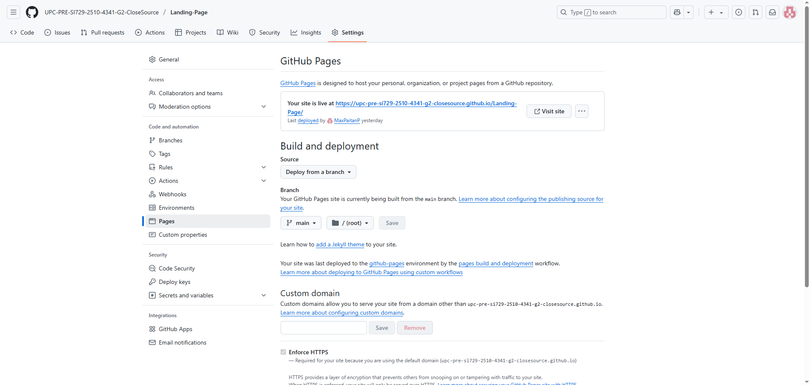 
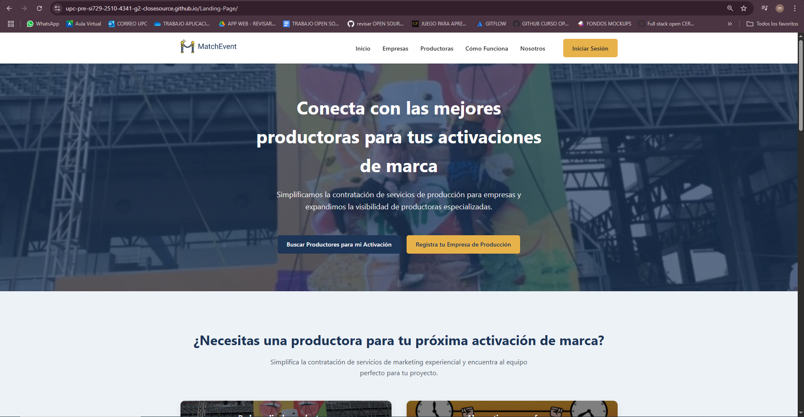

#### **5.2.1.8. Team Collaboration Insights during Sprint.** 

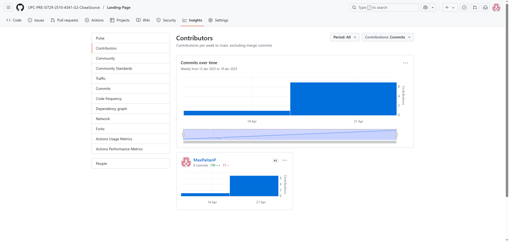
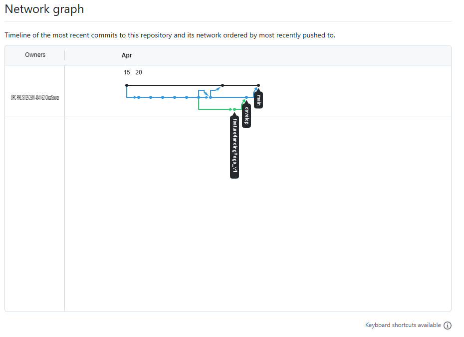

## **5.3. Video About-The-Team**

Link del video: 
> https://upcedupe-my.sharepoint.com/:v:/g/personal/u202318814_upc_edu_pe/EUyvInesFzdJmWMysZ4lPcIByep3N3oj_vODWkoify006w?e=8AGKCA&nav=eyJyZWZlcnJhbEluZm8iOnsicmVmZXJyYWxBcHAiOiJTdHJlYW1XZWJBcHAiLCJyZWZlcnJhbFZpZXciOiJTaGFyZURpYWxvZy1MaW5rIiwicmVmZXJyYWxBcHBQbGF0Zm9ybSI6IldlYiIsInJlZmVycmFsTW9kZSI6InZpZXcifX0%3D

# Conclusiones

El desarrollo inicial del proyecto MatchEvent ha permitido establecer una base sólida para una plataforma que busca facilitar la conexión entre empresas que requieren activaciones de marca y productoras que las ejecutan. A través del diseño de la landing page, se ha logrado plasmar una identidad visual coherente, moderna y alineada con los objetivos del negocio.

Además, se definieron aspectos clave como la propuesta de valor, los segmentos de usuarios, el flujo de navegación y la estructura técnica del proyecto, todo lo cual servirá como punto de partida para iteraciones futuras.

Este primer sprint ha sido fundamental para alinear al equipo en torno a una visión común, definir los lineamientos visuales y técnicos del producto, y validar decisiones iniciales desde una perspectiva de diseño centrado en el usuario.

# Recomendaciones

* Comprender en profundidad a los usuarios clave, para diseñar soluciones alineadas con sus necesidades, expectativas y comportamientos reales.

* Definir una propuesta de valor clara y visible desde el primer contacto, para captar la atención del usuario y comunicar rápidamente el propósito de la plataforma.

* Diseñar interfaces intuitivas que transmitan confianza, optimizando la navegación y facilitando los procesos tanto para empresas como para productoras.

* Utilizar tecnologías y metodologías escalables, que permitan mantener una base sólida y facilitar el crecimiento ordenado del proyecto.

* Validar constantemente con usuarios reales, a fin de recoger feedback temprano y ajustar funcionalidades antes de avanzar hacia etapas más complejas.

# Bibliografía:

Bardales, A., & Herrera, K. (2017). *Propuesta de modelo de gestión basado en el marketing experiencial para la generación de Brand Equity en el contexto peruano* (Tesis de licenciatura, Pontificia Universidad Católica del Perú). PUCP Repositorio Institucional. Recuperado de https://tesis.pucp.edu.pe/items/c66796b3-30b9-46b7-aae2-3c2ba015936a [Consulta: 16 de abril de 2025]

Moser, M. (2012). *Estrategias de marketing experiencial aplicadas al retail*. Universidad de San Andrés. Recuperado de https://repositorio.udesa.edu.ar/handle/10908/963 [Consulta: 16 de abril de 2025]

Verhelst, L. (2020). *Evolución del marketing experiencial desde la perspectiva de sus principales exponentes*. (Trabajo de grado, Pontificia Universidad Javeriana). Repositorio Institucional PUJ. Recuperado de https://repository.javeriana.edu.co/handle/10554/52760 [Consulta: 16 de abril de 2025]

# Anexos

* Landing Page link: https://upc-pre-si729-2510-4341-g2-closesource.github.io/Landing-Page/
  


